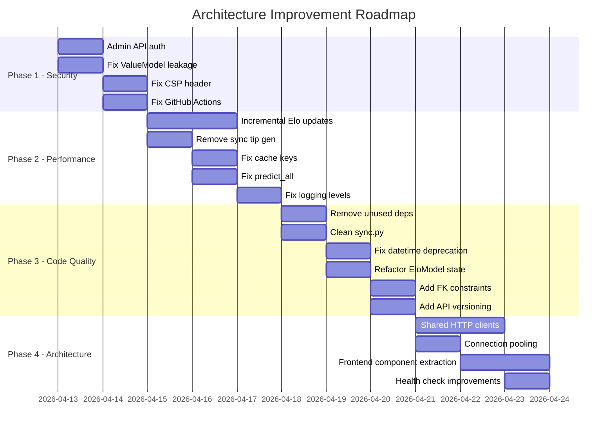

# WhatIsMyTip Architecture Review

**Date**: 2026-04-12  
**Reviewer**: Architect Mode  
**Scope**: Full-stack architecture review of backend, frontend, ML pipeline, and infrastructure

---

## 1. Architecture Summary

WhatIsMyTip is an AI-powered AFL tipping application built with a clean layered architecture:

```
Frontend (Nuxt 4 / Vue.js / Tailwind CSS)
    ↓ HTTP/REST
Backend (FastAPI)
    ├── API Layer (route handlers, validation)
    ├── Service Layer (business logic, orchestration)
    ├── CRUD Layer (data access, caching)
    ├── ML Pipeline (4 models + 3 heuristics)
    └── Cron Infrastructure (scheduled jobs)
        ↓
    External APIs: Squiggle API, OpenRouter
    Database: SQLite (dev) / PostgreSQL (prod)
```

**Key Components**:
- **Backend**: Python FastAPI with async SQLAlchemy, Alembic migrations
- **ML Pipeline**: [`ModelOrchestrator`](backend/app/orchestrator.py:13) → 4 statistical models (Elo, Form, Home Advantage, Value) → 3 heuristics (Best Bet, YOLO, High Risk)
- **Cron Jobs**: 4 scheduled jobs managed via [`CronJobManager`](backend/app/cron/__init__.py:22) with database-level locking
- **Frontend**: Nuxt 4 with static generation, Tailwind CSS, Chart.js
- **Infrastructure**: Digital Ocean App Platform, GitHub Actions

---

## 2. Strengths

### Well-Designed Layered Architecture
The API → Service → CRUD separation is clean and consistent. Each layer has a clear responsibility: API handles HTTP concerns, Service handles business logic, CRUD handles data access. This is evident across all modules — games, tips, backtest, jobs.

### Extensible ML Pipeline Design
The [`BaseModel`](backend/app/models_ml/base.py:7) and [`BaseHeuristic`](backend/app/heuristics/base.py:7) abstract base classes provide a clean contract for adding new models and heuristics. The [`ModelOrchestrator`](backend/app/orchestrator.py:13) runs models in parallel via `asyncio.gather`, which is efficient.

### Robust Cron Job Infrastructure
The cron system at [`base.py`](backend/app/cron/base.py:31) is well-designed with:
- Database-level job locking to prevent concurrent execution
- Execution tracking with success/failure metrics
- Error classification (transient vs permanent) with retry logic
- Configurable schedules via environment variables

### Good Configuration Management
[`Settings`](backend/app/config.py:6) uses pydantic-settings with proper validators, environment variable loading, and sensible defaults. All cron schedules, timeouts, and feature flags are configurable.

### Comprehensive Caching Strategy
The [`InMemoryCache`](backend/app/cache.py:30) with three TTL tiers (5min, 15min, 1hr) and the [`@cached`](backend/app/cache.py:116) decorator provide a pragmatic caching solution. Cache invalidation via [`invalidate_cache_pattern`](backend/app/cache.py:203) is called after mutations.

### Database Schema Design
Models in [`models/__init__.py`](backend/app/models/__init__.py:1) use appropriate unique constraints (`uq_game_heuristic`, `uq_game_model`, `uq_backtest_season_round_heuristic`) and indexes on frequently queried columns.

### Security Foundations
The middleware stack in [`main.py`](backend/main.py:20) includes security headers, request size limits, CORS restrictions (GET+OPTIONS only), and rate limiting via slowapi.

---

## 3. Issues Found

### CRITICAL Severity

#### C-1: Admin API Has No Authentication
**Files**: [`backend/app/api/admin/jobs.py`](backend/app/api/admin/jobs.py:42)  
**Problem**: All `/api/admin/jobs/*` endpoints allow unauthenticated access. Anyone can trigger:
- Daily game sync (POST `/api/admin/jobs/daily-sync/trigger`)
- Match completion detection (POST `/api/admin/jobs/match-completion/trigger`)
- Tip generation (POST `/api/admin/jobs/tip-generation/trigger`)
- Historic data refresh (POST `/api/admin/jobs/historic-refresh/trigger`)

These operations are expensive (sync 15+ seasons, regenerate all tips) and could be abused to exhaust API quotas, overload the database, or incur OpenRouter costs.

**Recommendation**: Add API key or JWT authentication middleware for all `/api/admin/*` routes. At minimum, implement a static admin API key via environment variable:
```python
# In admin/jobs.py
from app.config import settings

async def verify_admin_key(x_admin_key: str = Header(...)):
    if x_admin_key != settings.admin_api_key:
        raise HTTPException(status_code=401, detail="Unauthorized")
```

#### C-2: EloModel Recomputes All Historical Games on Every Update
**Files**: [`backend/app/models_ml/elo.py`](backend/app/models_ml/elo.py:36)  
**Problem**: Both [`_initialize_cache`](backend/app/models_ml/elo.py:36) and [`update_cache`](backend/app/models_ml/elo.py:97) load ALL completed games from the database and recompute ratings from scratch. With data spanning 2010-2026 (~3000+ games), this is called:
- After every game sync (every 15 minutes)
- After every match completion detection (every 15 minutes)
- On first prediction request

The Elo cache table exists but is only used for persistence between restarts — the full recomputation still happens on every `update_cache` call.

**Recommendation**: Implement incremental Elo updates. When new games complete, only process those new games against the existing cached ratings:
```python
@classmethod
async def update_cache_incremental(cls, db, newly_completed_games):
    async with cls._cache_lock:
        if not cls._cache_initialized:
            await cls._initialize_cache(db)
            return
        for game in newly_completed_games:
            # Update ratings incrementally
            ...
        cls._cache_initialized = True
        await cls.save_to_cache(db, cls._ratings_cache)
```

#### C-3: ValueModel Data Leakage in Backtesting
**Files**: [`backend/app/models_ml/value.py`](backend/app/models_ml/value.py:18)  
**Problem**: [`_calculate_win_rates`](backend/app/models_ml/value.py:18) does NOT filter by date. It calculates win rates using ALL completed games in the database, including games that occur AFTER the prediction target. This means:
- When backtesting 2020 games, the model uses results from 2021-2025
- Backtest accuracy metrics are artificially inflated
- The model appears more accurate than it actually is

Compare with [`HomeAdvantageModel`](backend/app/models_ml/home_advantage.py:19) and [`FormModel`](backend/app/models_ml/form.py:18) which correctly filter by `Game.date < game.date`.

**Recommendation**: Add temporal filtering to `_calculate_win_rates`:
```python
async def _calculate_win_rates(self, db: AsyncSession, before_date=None):
    for team in teams:
        query = select(...).where(
            or_(Game.home_team == team, Game.away_team == team),
            Game.completed == True,
        )
        if before_date:
            query = query.where(Game.date < before_date)
        ...
```

#### C-4: Synchronous Tip Generation in API Request Path
**Files**: [`backend/app/api/tips.py`](backend/app/api/tips.py:78)  
**Problem**: [`get_games_with_tips`](backend/app/api/tips.py:24) auto-generates tips synchronously when none exist (line 80: `await TipCRUD.regenerate_tips_for_round`). This means:
- The first user to request a new round triggers full ML pipeline execution
- Response time includes model prediction for all games in the round (~9 games × 4 models × 3 heuristics)
- Potential timeout for the HTTP request
- Multiple concurrent requests could race (mitigated by `with_for_update()` lock, but this blocks all reads)

**Recommendation**: Remove synchronous generation from the API path. Return an empty response with a `202 Accepted` or trigger async generation, letting the cron job handle it. The `TipGenerationJob` already runs daily at 3 AM.

---

### HIGH Severity

#### H-1: Excessive WARNING-Level Logging
**Files**: [`backend/app/orchestrator.py`](backend/app/orchestrator.py:46), [`backend/app/api/games.py`](backend/app/api/games.py:155)  
**Problem**: Routine timing/performance information is logged at `WARNING` level:
- [`orchestrator.py:46`](backend/app/orchestrator.py:46): `logger.warning(f"ModelOrchestrator.predict: STARTING...")`
- [`orchestrator.py:61`](backend/app/orchestrator.py:61): `logger.warning(f"...model took {time:.4f}s")`
- [`games.py:155`](backend/app/api/games.py:155): `logger.warning(f"get_game_detail: STARTING...")`
- [`games.py:161`](backend/app/api/games.py:161): `logger.warning(f"...Game fetch took {time:.4f}s")`

In production (`INFO` level), these still appear because WARNING > INFO. This pollutes logs, making it hard to identify actual warnings.

**Recommendation**: Change all timing/performance logs from `logger.warning` to `logger.debug` or `logger.info`. Reserve `WARNING` for unexpected but recoverable conditions.

#### H-2: CSP Header Blocks Analytics and Structured Data
**Files**: [`backend/main.py`](backend/main.py:29)  
**Problem**: `Content-Security-Policy: default-src 'self'` blocks:
- Umami analytics (loaded from external host)
- JSON-LD structured data (uses `innerHTML`)
- Any future CDN resources

The frontend [`nuxt.config.ts`](frontend/nuxt.config.ts:44) loads Umami from `process.env.UMAMI_HOST` and has inline JSON-LD scripts — both blocked by this CSP.

**Recommendation**: Update CSP to allow required sources:
```python
response.headers["Content-Security-Policy"] = (
    "default-src 'self'; "
    "script-src 'self' 'unsafe-inline' https://analytics.whatismytip.com; "
    "connect-src 'self' https://analytics.whatismytip.com; "
    "img-src 'self' data: https:; "
    "style-src 'self' 'unsafe-inline'"
)
```

#### H-3: GitHub Actions Workflow Calls Non-Existent Endpoints
**Files**: [`.github/workflows/scheduled.yml`](.github/workflows/scheduled.yml:18)  
**Problem**: The workflow calls three endpoints that don't exist:
- Line 18: `curl -X POST "https://api.whatismytip.com/api/sync/games"` — [`sync.py`](backend/app/api/sync.py) has no endpoints
- Line 35: `curl -X POST "https://api.whatismytip.com/api/tips/generate?..."` — no such POST endpoint exists
- Line 51: `curl -X POST "https://api.whatismytip.com/api/backtest/run?..."` — no such POST endpoint exists

These calls silently fail (curl returns error but workflow continues).

**Recommendation**: Either:
1. Remove the GitHub Actions workflow entirely since cron jobs are now managed by `fastapi-crons` within the app
2. Update endpoints to match actual admin API routes (`/api/admin/jobs/daily-sync/trigger`, etc.)

#### H-4: sync.py API Route Is Empty
**Files**: [`backend/app/api/sync.py`](backend/app/api/sync.py)  
**Problem**: The file imports modules and creates a router but defines zero endpoints. It's registered in the API router at [`api/__init__.py:13`](backend/app/api/__init__.py:13) but serves no purpose.

**Recommendation**: Either implement sync endpoints (e.g., `POST /api/sync/games`) or remove the file and its router registration.

#### H-5: datetime.utcnow() Used Throughout (Deprecated)
**Files**: Multiple  
**Problem**: `datetime.utcnow()` is deprecated in Python 3.12+ and will be removed in a future version. Found in:
- [`models/__init__.py:90,92`](backend/app/models/__init__.py:90)
- [`crud/elo_cache.py:36`](backend/app/crud/elo_cache.py:36)
- [`crud/jobs.py:27`](backend/app/crud/jobs.py:27)
- [`crud/generation_progress.py:37,73,78`](backend/app/crud/generation_progress.py:37)
- [`cron/base.py:142,166,189`](backend/app/cron/base.py:142)
- [`crud/games.py:161`](backend/app/crud/games.py:161)

**Recommendation**: Replace with `datetime.now(datetime.UTC)` or use `server_default=func.now()` for database columns.

#### H-6: EloModel Uses Class-Level Mutable State
**Files**: [`backend/app/models_ml/elo.py`](backend/app/models_ml/elo.py:21)  
**Problem**: [`EloModel`](backend/app/models_ml/elo.py:14) uses class variables for shared state:
```python
_ratings_cache: Dict[str, float] = {}
_cache_initialized = False
_cache_lock = asyncio.Lock()
```

This creates issues with:
- Testing (state leaks between tests)
- Multiple instances seeing different states during initialization
- `asyncio.Lock()` created at class definition time (before event loop exists)

**Recommendation**: Move to a singleton pattern or module-level state with proper initialization.

---

### MEDIUM Severity

#### M-1: scikit-learn Dependency Unused
**Files**: [`backend/pyproject.toml:18`](backend/pyproject.toml:18)  
**Problem**: `scikit-learn>=1.5.0` is listed as a dependency but never imported or used. This adds unnecessary installation size and attack surface.

**Recommendation**: Remove from `pyproject.toml`.

#### M-2: Database Docs Inconsistency
**Files**: [`.env.production:2`](.env.production:2)  
**Problem**: The production env file references a Render PostgreSQL URL (`db-do-user-xxx.oregon-postgres.render.com`) but the project is deployed on Digital Ocean App Platform. This is confusing for developers.

**Recommendation**: Update `.env.production` with the correct Digital Ocean database connection string or use a placeholder that clearly indicates the platform.

#### M-3: Duplicate Code in EloModel
**Files**: [`backend/app/models_ml/elo.py`](backend/app/models_ml/elo.py:36)  
**Problem**: [`_initialize_cache`](backend/app/models_ml/elo.py:36) (lines 36-94) and [`update_cache`](backend/app/models_ml/elo.py:97) (lines 97-158) contain nearly identical code — both load all teams, initialize ratings to 1500, fetch all completed games, and process them chronologically. The only difference is `update_cache` also persists to the database.

**Recommendation**: Extract the common logic into a private method:
```python
@classmethod
async def _recompute_ratings(cls, db):
    # Common logic
    ...

@classmethod
async def _initialize_cache(cls, db):
    await cls._recompute_ratings(db)
    cls._cache_initialized = True

@classmethod
async def update_cache(cls, db):
    await cls._recompute_ratings(db)
    await cls.save_to_cache(db, cls._ratings_cache)
```

#### M-4: SquiggleClient Created Per-Request
**Files**: [`backend/app/api/admin/jobs.py:71`](backend/app/api/admin/jobs.py:71), [`backend/app/cron/jobs/daily_sync.py:73`](backend/app/cron/jobs/daily_sync.py:73)  
**Problem**: Every admin endpoint and cron job creates a new `SquiggleClient()` which instantiates a new `httpx.AsyncClient`. This is inefficient — connection pools are not reused.

**Recommendation**: Use a shared client via dependency injection or FastAPI's app state:
```python
# In app/squiggle/__init__.py or as a FastAPI dependency
squiggle_client = SquiggleClient()

# In lifespan
async def lifespan(app):
    yield
    await squiggle_client.close()
```

#### M-5: BacktestService Instantiates ModelOrchestrator Unnecessarily
**Files**: [`backend/app/services/backtest.py:20`](backend/app/services/backtest.py:20)  
**Problem**: [`BacktestService.__init__`](backend/app/services/backtest.py:19) creates a `ModelOrchestrator()` just to call `get_available_heuristics()`. This initializes 4 ML models and 3 heuristics for every backtest request, even though backtesting only reads stored tips from the database.

**Recommendation**: Hardcode the heuristic list or load it from configuration instead of instantiating the full ML pipeline.

#### M-6: Cache Key Includes SQLAlchemy Session
**Files**: [`backend/app/cache.py:138`](backend/app/cache.py:138)  
**Problem**: The `@cached` decorator builds cache keys from `str(args)`, which includes the SQLAlchemy `AsyncSession` object. This produces non-deterministic keys like `game_by_id:<AsyncSession object at 0x...>:...` which means:
- Cache never hits across different requests (different session objects)
- Cache keys are unnecessarily long

**Recommendation**: Exclude the `db` parameter from cache key generation:
```python
# Filter out db session from cache key
cache_args = [a for a in args if not isinstance(a, AsyncSession)]
cache_key = f"{key_prefix}{func.__name__}:{str(cache_args)}:{str(sorted(kwargs.items()))}"
```

#### M-7: No Database Connection Pooling Configuration
**Files**: [`backend/app/db/__init__.py`](backend/app/db/__init__.py:5)  
**Problem**: The async engine is created with default pool settings. For production PostgreSQL under load, this needs explicit configuration:
```python
engine = create_async_engine(settings.database_url, echo=...)
# Missing: pool_size, max_overflow, pool_recycle, pool_pre_ping
```

**Recommendation**: Add explicit pool configuration for production:
```python
engine = create_async_engine(
    settings.database_url,
    echo=settings.environment == "development",
    pool_size=10,
    max_overflow=20,
    pool_recycle=3600,
    pool_pre_ping=True,
)
```

#### M-8: predict_all Runs Models Multiple Times
**Files**: [`backend/app/orchestrator.py:91`](backend/app/orchestrator.py:91)  
**Problem**: [`predict_all`](backend/app/orchestrator.py:91) calls [`predict`](backend/app/orchestrator.py:32) for each heuristic, and each `predict` call runs all 4 models. With 3 heuristics, this means 12 model executions instead of 4. Models should be run once and their results reused across heuristics.

**Recommendation**: Refactor to run models once, then apply all heuristics:
```python
async def predict_all(self, game, db=None):
    # Run models once
    model_predictions = {}
    for model_name, prediction in await asyncio.gather(*[
        predict_with_logging(m) for m in self.models
    ]):
        model_predictions[model_name] = prediction
    
    # Apply all heuristics to the same predictions
    results = {}
    for name, heuristic in self.heuristics.items():
        results[name] = await heuristic.apply(game, model_predictions)
    return results
```

#### M-9: Missing Foreign Key Constraints
**Files**: [`backend/app/models/__init__.py`](backend/app/models/__init__.py:29)  
**Problem**: `Tip.game_id`, `ModelPrediction.game_id` have no foreign key constraints to `Game.id`. This means:
- Orphaned records can exist if a game is deleted
- Database cannot enforce referential integrity
- Query planner has less information for optimization

**Recommendation**: Add foreign key constraints:
```python
game_id = Column(Integer, ForeignKey('games.id'), index=True)
```

#### M-10: No API Versioning
**Files**: [`backend/app/api/__init__.py`](backend/app/api/__init__.py:8)  
**Problem**: All routes are under `/api/` with no version prefix. Breaking changes to any endpoint would affect all clients simultaneously.

**Recommendation**: Add version prefix: `api_router = APIRouter(prefix="/api/v1")`

#### M-11: Deprecated startup_event
**Files**: [`backend/main.py:57`](backend/main.py:57)  
**Problem**: `@app.on_event("startup")` is deprecated in newer FastAPI versions. The recommended approach is lifespan context managers.

**Recommendation**: Migrate to lifespan:
```python
from contextlib import asynccontextmanager

@asynccontextmanager
async def lifespan(app):
    await cron_mgr.register_jobs()
    yield

app = FastAPI(lifespan=lifespan, ...)
```

---

### LOW Severity

#### L-1: BacktestResult Table Effectively Unused
**Files**: [`backend/app/models/__init__.py:62`](backend/app/models/__init__.py:62), [`backend/app/services/backtest.py`](backend/app/services/backtest.py:16)  
**Problem**: The `BacktestResult` model and `BacktestCRUD` exist but backtest endpoints calculate metrics directly from `Tip` and `Game` tables via `BacktestService`. The stored `BacktestResult` records are never written by the current code flow.

**Recommendation**: Either remove the unused table/CRUD or integrate it as a materialized cache for expensive backtest computations.

#### L-2: Team Logo Mapping Duplicated
**Files**: [`frontend/pages/index.vue`](frontend/pages/index.vue), [`frontend/pages/game/[id].vue:147`](frontend/pages/game/[id].vue:147)  
**Problem**: The `getLogoUrl` function with the team-to-filename mapping is duplicated across multiple Vue components.

**Recommendation**: Extract to a shared composable:
```typescript
// composables/useTeamLogos.ts
export const useTeamLogos = () => {
    const getLogoUrl = (teamName: string): string => { ... }
    return { getLogoUrl }
}
```

#### L-3: ExplanationService Re-runs Models
**Files**: [`backend/app/services/explanation.py:30`](backend/app/services/explanation.py:30)  
**Problem**: [`generate_for_tip`](backend/app/services/explanation.py:15) re-runs all ML models to get predictions for context, even though those predictions are already stored in the `model_predictions` table.

**Recommendation**: Load stored predictions from `ModelPredictionCRUD` instead of recomputing.

#### L-4: Request Size Limit Mismatch
**Files**: [`backend/main.py:36`](backend/main.py:36), [`backend/main.py:70`](backend/main.py:70)  
**Problem**: `RequestSizeLimitMiddleware` constructor defaults to 10MB but the actual instantiation uses 5MB. The comment says "5MB" but the class default says 10MB.

**Recommendation**: Align the default value with the intended limit.

#### L-5: No Health Check for External APIs
**Files**: [`backend/main.py:100`](backend/main.py:100)  
**Problem**: The `/health` endpoint only checks database connectivity. If Squiggle API or OpenRouter is down, the health check still returns "healthy".

**Recommendation**: Add optional external API health checks:
```python
@app.get("/health/detailed")
async def detailed_health():
    checks = {
        "database": await check_db(),
        "squiggle_api": await check_squiggle(),
    }
    ...
```

#### L-6: Frontend Pages Are Monolithic
**Files**: [`frontend/pages/index.vue`](frontend/pages/index.vue) (742 lines), [`frontend/pages/backtest.vue`](frontend/pages/backtest.vue) (1165 lines)  
**Problem**: These pages mix template, script, and extensive styles in single files, making them hard to maintain.

**Recommendation**: Extract reusable components (stat cards, data tables, chart containers) into the `components/` directory.

---

## 4. Detailed Analysis by Review Dimension

### 4.1 Separation of Concerns — Rating: GOOD
The layered architecture is well-maintained across most of the codebase. The API layer handles HTTP concerns, services handle business logic, and CRUD handles data access. However, there are some violations:
- [`tips.py:80`](backend/app/api/tips.py:80): API layer directly calls `TipCRUD.regenerate_tips_for_round` which contains business logic
- [`games.py:33-110`](backend/app/api/games.py:33): Complex query logic in the API handler for the `latest` parameter should be in a service or CRUD method
- [`admin/jobs.py`](backend/app/api/admin/jobs.py): Admin endpoints contain service-level orchestration (creating clients, calling services, updating caches)

### 4.2 Dependency Management — Rating: ADEQUATE
Dependencies are generally well-managed:
- Services receive dependencies via constructor injection (`squiggle_client`, `db_session`)
- Configuration is externalized via pydantic-settings
- **Gap**: No dependency injection framework — services are instantiated manually in API handlers
- **Gap**: `BacktestService()` takes no dependencies, creates `ModelOrchestrator` internally
- **Gap**: `SquiggleClient()` is created fresh in every cron job and admin endpoint

### 4.3 Error Handling — Rating: GOOD
Error handling is consistent and well-structured:
- Custom exception hierarchy in cron: [`JobError`](backend/app/cron/base.py:16) → [`TransientJobError`](backend/app/cron/base.py:21) / [`PermanentJobError`](backend/app/cron/base.py:25)
- Graceful fallbacks in ML pipeline: models return defaults on error ([`orchestrator.py:67`](backend/app/orchestrator.py:67))
- OpenRouter fallback explanations ([`openrouter/client.py:62`](backend/app/openrouter/client.py:62))
- **Gap**: No custom exception classes for the API layer (uses generic `HTTPException`)
- **Gap**: Some broad `except Exception` catches that could mask issues

### 4.4 Scalability — Rating: NEEDS IMPROVEMENT
Key bottlenecks:
- **EloModel full recomputation** (C-2): O(n) where n = all completed games, called every 15 min
- **Synchronous tip generation** (C-4): Blocks API request while running ML pipeline
- **No database connection pooling config** (M-7): Default pool may be insufficient under load
- **In-memory cache**: Not shared across instances if scaled horizontally
- **No pagination** on several list endpoints

### 4.5 Data Flow — Rating: GOOD
Data flow is generally clean and traceable:
```
Squiggle API → GameSyncService → GameCRUD → Game table
Game table → TipGenerationService → ModelOrchestrator → Tip table + ModelPrediction table
Tip table + Game table → BacktestService → Comparison metrics
```
- **Gap**: `ExplanationService` breaks the flow by re-running models instead of reading stored predictions
- **Gap**: Circular import risk in `crud/tips.py` which imports `GameCRUD` and `ModelOrchestrator` inside methods

### 4.6 Configuration Management — Rating: GOOD
- All config via [`Settings`](backend/app/config.py:6) with pydantic-settings
- Environment-specific values in `.env` files
- Cron schedules, timeouts, feature flags all configurable
- **Gap**: `.env.production` has incorrect database URL (M-2)

### 4.7 Database Design — Rating: ADEQUATE
- Good use of unique constraints and indexes
- Alembic migrations for schema evolution
- **Gap**: Missing foreign key constraints (M-9)
- **Gap**: `BacktestResult` table is unused (L-1)
- **Gap**: `GenerationProgress` uses Python-side defaults instead of server defaults

### 4.8 API Design — Rating: ADEQUATE
- RESTful conventions mostly followed
- Consistent response schemas with Pydantic
- Rate limiting on all endpoints
- **Gap**: No API versioning (M-10)
- **Gap**: Empty sync router (H-4)
- **Gap**: Some deprecated endpoints return empty data ([`backtest.py:42-51`](backend/app/api/backtest.py:42))

### 4.9 Cron/Background Processing — Rating: GOOD
- Well-designed job infrastructure with locking, tracking, error classification
- Configurable schedules and timeouts
- Manual trigger endpoints for admin use
- **Gap**: No actual cron scheduler — `fastapi-crons` is listed as dependency but jobs are registered without scheduling mechanism. The `CronJobManager` registers jobs but doesn't appear to schedule them.

### 4.10 ML Pipeline Design — Rating: ADEQUATE
- Clean model/heuristic abstractions
- Parallel model execution
- **Gap**: ValueModel data leakage (C-3)
- **Gap**: `predict_all` runs models multiple times (M-8)
- **Gap**: No model versioning or A/B testing support
- **Gap**: No confidence calibration or model performance tracking

### 4.11 Caching Strategy — Rating: ADEQUATE
- Three-tier TTL strategy is pragmatic
- Cache invalidation after mutations
- **Gap**: Cache keys include session objects, preventing cross-request hits (M-6)
- **Gap**: In-memory only — not suitable for horizontal scaling
- **Gap**: No cache warming strategy — first requests are always cold

### 4.12 Frontend Architecture — Rating: ADEQUATE
- Clean composable pattern for API access ([`useApi.ts`](frontend/composables/useApi.ts))
- Proper TypeScript interfaces
- SEO well-handled with meta tags and JSON-LD
- **Gap**: Monolithic page components (L-6)
- **Gap**: Duplicated utility functions (L-2)
- **Gap**: No error boundary or global error handling
- **Gap**: `generateTips` function in `useApi.ts` calls non-existent endpoint

---

## 5. Refactoring Recommendations (Prioritized)

### Phase 1 — Security & Correctness (Immediate)
1. **Add authentication to admin API** (C-1) — Add API key header check
2. **Fix ValueModel data leakage** (C-3) — Add date filtering to `_calculate_win_rates`
3. **Fix CSP header** (H-2) — Allow analytics and inline scripts
4. **Fix GitHub Actions workflow** (H-3) — Remove or update to use correct endpoints

### Phase 2 — Performance (Short-term)
5. **Implement incremental Elo updates** (C-2) — Only process newly completed games
6. **Remove synchronous tip generation from API** (C-4) — Return empty, let cron handle
7. **Fix cache key generation** (M-6) — Exclude session from keys
8. **Fix predict_all double execution** (M-8) — Run models once, apply all heuristics
9. **Fix logging levels** (H-1) — Change WARNING to DEBUG for timing logs

### Phase 3 — Code Quality (Medium-term)
10. **Remove unused dependencies** (M-1) — Remove scikit-learn
11. **Remove/clean empty sync.py** (H-4) — Add endpoints or remove
12. **Fix datetime.utcnow() deprecation** (H-5) — Migrate to `datetime.now(UTC)`
13. **Refactor EloModel class-level state** (H-6) — Use singleton or module-level
14. **Add foreign key constraints** (M-9) — New migration
15. **Add API versioning** (M-10) — Prefix with `/api/v1`
16. **Migrate to lifespan** (M-11) — Replace `on_event`
17. **Fix .env.production** (M-2) — Correct database URL
18. **Deduplicate EloModel code** (M-3) — Extract common method

### Phase 4 — Architecture Improvements (Long-term)
19. **Shared HTTP clients** (M-4) — Singleton SquiggleClient/OpenRouterClient
20. **Database connection pooling** (M-7) — Configure for production
21. **Extract frontend components** (L-6) — Break up monolithic pages
22. **Shared team logo composable** (L-2) — Deduplicate mapping
23. **Fix ExplanationService** (L-3) — Use stored predictions
24. **Add external API health checks** (L-5)
25. **Clean up BacktestResult usage** (L-1) — Integrate or remove

---

## 6. Architecture Improvement Roadmap



---

## 7. Issue Summary Table

| ID | Severity | Component | Issue | Effort |
|----|----------|-----------|-------|--------|
| C-1 | CRITICAL | Security | Admin API unauthenticated | Small |
| C-2 | CRITICAL | Performance | EloModel full recomputation | Medium |
| C-3 | CRITICAL | ML Pipeline | ValueModel data leakage | Small |
| C-4 | CRITICAL | API Design | Sync tip generation in request | Small |
| H-1 | HIGH | Logging | Excessive WARNING logging | Small |
| H-2 | HIGH | Security | CSP too restrictive | Small |
| H-3 | HIGH | Infrastructure | GitHub Actions wrong endpoints | Small |
| H-4 | HIGH | API Design | Empty sync.py | Small |
| H-5 | HIGH | Code Quality | datetime.utcnow deprecated | Small |
| H-6 | HIGH | ML Pipeline | EloModel class-level state | Medium |
| M-1 | MEDIUM | Dependencies | Unused scikit-learn | Trivial |
| M-2 | MEDIUM | Config | Wrong .env.production DB URL | Trivial |
| M-3 | MEDIUM | Code Quality | Duplicate EloModel code | Small |
| M-4 | MEDIUM | Performance | SquiggleClient per-request | Small |
| M-5 | MEDIUM | Performance | Unnecessary ModelOrchestrator in BacktestService | Small |
| M-6 | MEDIUM | Caching | Cache keys include session | Small |
| M-7 | MEDIUM | Database | No connection pool config | Small |
| M-8 | MEDIUM | ML Pipeline | predict_all runs models ×3 | Small |
| M-9 | MEDIUM | Database | Missing FK constraints | Medium |
| M-10 | MEDIUM | API Design | No API versioning | Small |
| M-11 | MEDIUM | Code Quality | Deprecated startup event | Small |
| L-1 | LOW | Database | Unused BacktestResult table | Small |
| L-2 | LOW | Frontend | Duplicated logo mapping | Trivial |
| L-3 | LOW | ML Pipeline | ExplanationService re-runs models | Small |
| L-4 | LOW | Config | Request size limit mismatch | Trivial |
| L-5 | LOW | Monitoring | No external API health check | Small |
| L-6 | LOW | Frontend | Monolithic page components | Medium |
