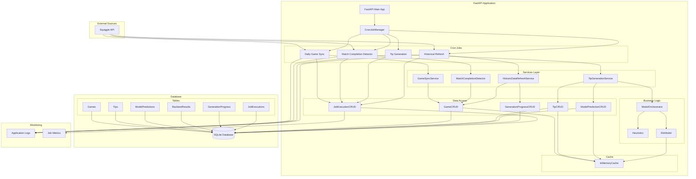
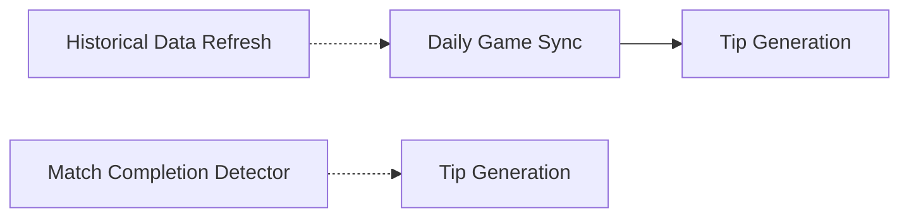

# Cron-Based Data Collection Architecture Design

## Executive Summary

This document outlines the architecture for rebuilding the WhatIsMyTip data collection and computation system using `fastapi-crons` for cron job management. The new system will provide reliable, scheduled data scraping, match completion detection, tip generation, and historical data refresh capabilities.

---

## 1. Architecture Diagram



---

## 2. Cron Job Schedule Specification

### 2.1 Job Definitions

| Job Name | Schedule | Purpose | Dependencies |
|----------|----------|---------|--------------|
| `daily_game_sync` | `0 2 * * *` (2:00 AM daily) | Sync all games for current season, update Elo cache | None |
| `match_completion_detector` | `*/15 * * * *` (every 15 minutes) | Detect and scrape completed matches | None |
| `tip_generation` | `0 3 * * *` (3:00 AM daily) | Generate tips for upcoming rounds | `daily_game_sync` |
| `historical_data_refresh` | `0 4 * * 0` (4:00 AM Sundays) | Refresh historical data for missing seasons | None |

### 2.2 Schedule Rationale

**Daily Game Sync (2:00 AM)**
- Runs during off-peak hours to minimize API load
- Ensures fresh data before tip generation
- Provides buffer for any API delays

**Match Completion Detector (every 15 minutes)**
- Frequent enough to detect completed matches quickly
- ~1 hour buffer after scheduled game time ensures match is complete
- Minimal resource impact with lightweight checks

**Tip Generation (3:00 AM)**
- Runs after daily game sync completes
- Ensures latest game data is used for predictions
- Provides tips before users wake up

**Historical Data Refresh (Sunday 4:00 AM)**
- Weekly refresh for historical data
- Off-peak timing
- Only processes missing data to avoid redundant work

### 2.3 Job Dependencies



- **Tip Generation** depends on **Daily Game Sync** to ensure current season data is available
- **Match Completion Detector** can optionally trigger **Tip Generation** when new completed games are detected
- **Historical Data Refresh** is independent but may be followed by **Daily Game Sync** to ensure consistency

---

## 3. Component Design

### 3.1 CronJobManager

**Location:** `backend/app/crons/__init__.py`

**Purpose:** Central coordinator for all cron jobs using fastapi-crons

**Responsibilities:**
- Initialize and register all cron jobs with fastapi-crons
- Manage job lifecycle (start, stop, restart)
- Provide job status monitoring
- Handle job execution errors and retries

**Key Methods:**
```python
class CronJobManager:
    def __init__(self, app: FastAPI)
    async def register_jobs(self) -> None
    async def get_job_status(self, job_name: str) -> JobStatus
    async def trigger_job(self, job_name: str) -> None
    async def disable_job(self, job_name: str) -> None
    async def enable_job(self, job_name: str) -> None
```

**Integration with fastapi-crons:**
```python
from fastapi_crons import CronJob

@app.on_event("startup")
async def startup_cron_jobs():
    manager = CronJobManager(app)
    await manager.register_jobs()
```

### 3.2 GameSyncService

**Location:** `backend/app/services/game_sync.py`

**Purpose:** Service for syncing games from Squiggle API

**Responsibilities:**
- Fetch games from Squiggle API for specified seasons/rounds
- Create or update games in database
- Handle duplicate detection
- Update Elo ratings cache after sync
- Track sync progress

**Key Methods:**
```python
class GameSyncService:
    async def sync_current_season(self, db: AsyncSession) -> SyncResult
    async def sync_season(self, db: AsyncSession, season: int) -> SyncResult
    async def sync_round(self, db: AsyncSession, season: int, round_id: int) -> SyncResult
    async def sync_game(self, db: AsyncSession, squiggle_id: int) -> Optional[Game]
    async def update_elo_cache(self, db: AsyncSession) -> None
```

**SyncResult:**
```python
@dataclass
class SyncResult:
    games_synced: int
    games_created: int
    games_updated: int
    games_skipped: int
    errors: List[str]
    duration_seconds: float
```

### 3.3 MatchCompletionDetector

**Location:** `backend/app/services/match_completion.py`

**Purpose:** Logic for detecting and processing completed matches

**Responsibilities:**
- Identify games that should be completed based on scheduled time
- Check Squiggle API for final scores
- Mark games as completed in database
- Trigger tip generation for newly completed games (if needed)
- Handle edge cases (postponed games, cancelled games)

**Key Methods:**
```python
class MatchCompletionDetector:
    async def detect_completed_matches(self, db: AsyncSession) -> List[Game]
    async def scrape_completed_match(self, db: AsyncSession, game: Game) -> bool
    async def is_match_buffer_elapsed(self, game: Game) -> bool
    async def process_completed_matches(self, db: AsyncSession) -> ProcessResult
```

**Buffer Logic:**
- Games are considered ready for completion scraping 1 hour after scheduled start time
- This buffer accounts for overtime, delays, and API lag
- Configurable via settings

### 3.4 TipGenerationService

**Location:** `backend/app/services/tip_generation.py`

**Purpose:** Service for generating tips using ML models and heuristics

**Responsibilities:**
- Identify games needing tips (upcoming, not yet generated)
- Run ModelOrchestrator for predictions
- Apply heuristics to generate final tips
- Store tips and model predictions
- Update game status flags
- Handle batch generation for efficiency

**Key Methods:**
```python
class TipGenerationService:
    async def generate_for_round(self, db: AsyncSession, season: int, round_id: int) -> GenerationResult
    async def generate_for_game(self, db: AsyncSession, game: Game) -> GenerationResult
    async def generate_batch(self, db: AsyncSession, games: List[Game]) -> GenerationResult
    async def regenerate_for_round(self, db: AsyncSession, season: int, round_id: int) -> GenerationResult
```

**GenerationResult:**
```python
@dataclass
class GenerationResult:
    games_processed: int
    tips_created: int
    model_predictions_created: int
    errors: List[str]
    duration_seconds: float
    heuristics_used: List[str]
```

### 3.5 HistoricDataRefreshService

**Location:** `backend/app/services/historical_refresh.py`

**Purpose:** Service for refreshing historical data

**Responsibilities:**
- Identify missing historical data (seasons/rounds/games)
- Sync missing games from Squiggle API
- Generate tips and predictions for historical games
- Track progress via GenerationProgress table
- Support partial refresh (specific seasons/rounds)
- Handle rate limiting for API calls

**Key Methods:**
```python
class HistoricDataRefreshService:
    async def refresh_all_seasons(self, db: AsyncSession, start_year: int = 2010, end_year: int = None) -> RefreshResult
    async def refresh_season(self, db: AsyncSession, season: int) -> RefreshResult
    async def refresh_round(self, db: AsyncSession, season: int, round_id: int) -> RefreshResult
    async def get_missing_data(self, db: AsyncSession, start_year: int, end_year: int) -> MissingDataReport
    async def track_progress(self, db: AsyncSession, operation_type: str, total_items: int) -> GenerationProgress
```

**MissingDataReport:**
```python
@dataclass
class MissingDataReport:
    missing_seasons: List[int]
    missing_rounds: Dict[int, List[int]]  # season -> [round_ids]
    missing_games: List[Tuple[int, int, int]]  # (season, round_id, squiggle_id)
```

---

## 4. Database Schema Changes

### 4.1 New Table: JobExecutions

**Purpose:** Track execution history of cron jobs for monitoring and debugging

```sql
CREATE TABLE job_executions (
    id INTEGER PRIMARY KEY AUTOINCREMENT,
    job_name VARCHAR(100) NOT NULL,
    status VARCHAR(20) NOT NULL,  -- pending, running, completed, failed
    started_at DATETIME NOT NULL,
    completed_at DATETIME,
    duration_seconds FLOAT,
    items_processed INTEGER DEFAULT 0,
    items_succeeded INTEGER DEFAULT 0,
    items_failed INTEGER DEFAULT 0,
    error_message TEXT,
    error_details TEXT,  -- JSON for structured error info
    metadata TEXT,  -- JSON for additional context
    created_at DATETIME DEFAULT CURRENT_TIMESTAMP
);

CREATE INDEX idx_job_executions_job_name ON job_executions(job_name);
CREATE INDEX idx_job_executions_status ON job_executions(status);
CREATE INDEX idx_job_executions_started_at ON job_executions(started_at);
CREATE INDEX idx_job_executions_job_started ON job_executions(job_name, started_at);
```

### 4.2 New Table: JobLocks

**Purpose:** Prevent concurrent execution of the same job

```sql
CREATE TABLE job_locks (
    id INTEGER PRIMARY KEY AUTOINCREMENT,
    job_name VARCHAR(100) NOT NULL UNIQUE,
    locked_at DATETIME NOT NULL,
    locked_by VARCHAR(100),  -- hostname/pod identifier
    expires_at DATETIME NOT NULL,
    created_at DATETIME DEFAULT CURRENT_TIMESTAMP
);

CREATE INDEX idx_job_locks_expires_at ON job_locks(expires_at);
```

### 4.3 New Table: EloCache

**Purpose:** Persist Elo ratings cache for faster initialization

```sql
CREATE TABLE elo_cache (
    id INTEGER PRIMARY KEY AUTOINCREMENT,
    team_name VARCHAR(100) NOT NULL UNIQUE,
    rating FLOAT NOT NULL,
    games_played INTEGER DEFAULT 0,
    last_updated DATETIME NOT NULL,
    created_at DATETIME DEFAULT CURRENT_TIMESTAMP
);

CREATE INDEX idx_elo_cache_team_name ON elo_cache(team_name);
```

### 4.4 Modified Table: Games

**Additions:**
- `squiggle_complete_status` - Store raw Squiggle completion value (0-100)
- `last_synced_at` - Track when game was last synced from Squiggle
- `sync_count` - Track number of syncs for this game

```sql
ALTER TABLE games ADD COLUMN squiggle_complete_status INTEGER;
ALTER TABLE games ADD COLUMN last_synced_at DATETIME;
ALTER TABLE games ADD COLUMN sync_count INTEGER DEFAULT 0;
```

### 4.5 Modified Table: GenerationProgress

**Additions:**
- `job_execution_id` - Link to job execution record
- `current_item` - Track current item being processed
- `estimated_remaining_seconds` - Estimated time remaining

```sql
ALTER TABLE generation_progress ADD COLUMN job_execution_id INTEGER;
ALTER TABLE generation_progress ADD COLUMN current_item INTEGER;
ALTER TABLE generation_progress ADD COLUMN estimated_remaining_seconds INTEGER;
```

### 4.6 Migration Strategy

1. Create migration file: `backend/alembic/versions/YYYY_MM_DD_HHMM-add_cron_job_tables.py`
2. Add new tables (JobExecutions, JobLocks, EloCache)
3. Modify existing tables (Games, GenerationProgress)
4. Create indexes for performance
5. Add foreign key constraints where appropriate
6. Test migration on development database
7. Deploy to production with backup

---

## 5. Error Handling and Retry Logic

### 5.1 Retry Strategy

**fastapi-crons Built-in Retry:**
```python
from fastapi_crons import retry_on_failure

@retry_on_failure(
    max_retries=3,
    retry_delay=1.0,
    backoff_multiplier=2.0,
    max_delay=300.0,
    jitter=0.1
)
async def fetch_squiggle_data():
    # API call that may fail transiently
    pass
```

**Retry Configuration:**

| Error Type | Max Retries | Initial Delay | Backoff | Max Delay |
|------------|-------------|---------------|---------|-----------|
| Network timeout | 3 | 1s | 2x | 60s |
| HTTP 5xx | 3 | 2s | 2x | 60s |
| HTTP 429 (rate limit) | 5 | 5s | 2x | 300s |
| Database lock | 2 | 0.5s | 1.5x | 10s |
| Squiggle API error | 3 | 1s | 2x | 60s |

### 5.2 Error Classification

**Transient Errors (Retryable):**
- Network timeouts
- HTTP 5xx errors
- Rate limiting (429)
- Temporary database locks
- Squiggle API temporary failures

**Permanent Errors (Non-retryable):**
- HTTP 4xx errors (except 429)
- Invalid data format
- Database constraint violations
- Configuration errors

### 5.3 Dead Letter Queue

**Purpose:** Store failed jobs for manual review and retry

**Implementation:**
```python
class DeadLetterQueue:
    async def enqueue_failed_job(
        self,
        job_name: str,
        error: Exception,
        context: dict
    ) -> None
    
    async def get_failed_jobs(
        self,
        job_name: Optional[str] = None,
        limit: int = 100
    ) -> List[FailedJob]
    
    async def retry_failed_job(
        self,
        failed_job_id: int
    ) -> bool
```

**FailedJob Schema:**
```python
@dataclass
class FailedJob:
    id: int
    job_name: str
    error_type: str
    error_message: str
    error_stacktrace: str
    context: dict  # JSON
    failed_at: datetime
    retry_count: int
    max_retries: int
```

### 5.4 Alerting

**Critical Alerts:**
- Job failure after max retries
- Job execution timeout
- Database connection failures
- Squiggle API unavailability for > 5 minutes

**Warning Alerts:**
- Job execution takes > 2x expected duration
- High error rate (> 10% failure rate)
- Near rate limit threshold

**Implementation:**
```python
class AlertManager:
    async def send_critical_alert(self, message: str, context: dict) -> None
    async def send_warning_alert(self, message: str, context: dict) -> None
    async def check_job_health(self, job_name: str) -> HealthStatus
```

---

## 6. Configuration Management

### 6.1 Configuration Structure

**New Settings in `backend/app/config.py`:**

```python
class Settings(BaseSettings):
    # ... existing settings ...
    
    # Cron Job Configuration
    cron_enabled: bool = True
    cron_timezone: str = "Australia/Perth"
    
    # Daily Game Sync
    daily_sync_schedule: str = "0 2 * * *"  # 2:00 AM
    daily_sync_timeout_seconds: int = 3600  # 1 hour
    
    # Match Completion Detector
    completion_check_schedule: str = "*/15 * * * *"  # Every 15 minutes
    completion_buffer_minutes: int = 60  # 1 hour buffer
    completion_check_timeout_seconds: int = 300  # 5 minutes
    
    # Tip Generation
    tip_generation_schedule: str = "0 3 * * *"  # 3:00 AM
    tip_generation_timeout_seconds: int = 1800  # 30 minutes
    
    # Historical Data Refresh
    historical_refresh_schedule: str = "0 4 * * 0"  # Sunday 4:00 AM
    historical_refresh_start_year: int = 2010
    historical_refresh_timeout_seconds: int = 7200  # 2 hours
    
    # Retry Configuration
    retry_max_retries: int = 3
    retry_initial_delay: float = 1.0
    retry_backoff_multiplier: float = 2.0
    retry_max_delay: float = 300.0
    retry_jitter: float = 0.1
    
    # Job Lock Configuration
    job_lock_timeout_seconds: int = 3600  # 1 hour
    
    # Alerting Configuration
    alert_enabled: bool = False
    alert_webhook_url: Optional[str] = None
    alert_email_recipients: List[str] = []
    
    # Monitoring Configuration
    metrics_enabled: bool = True
    metrics_retention_days: int = 30
```

### 6.2 Environment Variables

```bash
# .env.production
CRON_ENABLED=true
CRON_TIMEZONE=Australia/Perth

DAILY_SYNC_SCHEDULE="0 2 * * *"
COMPLETION_CHECK_SCHEDULE="*/15 * * * *"
TIP_GENERATION_SCHEDULE="0 3 * * *"
HISTORICAL_REFRESH_SCHEDULE="0 4 * * 0"

COMPLETION_BUFFER_MINUTES=60
RETRY_MAX_RETRIES=3

ALERT_ENABLED=true
ALERT_WEBHOOK_URL=https://hooks.slack.com/services/...
```

### 6.3 Configuration Validation

**Validation Rules:**
- Cron schedules must be valid cron expressions
- Timeouts must be positive integers
- Buffer times must be reasonable (30-120 minutes)
- Retry counts must be >= 0
- Years must be within valid range (2010-current_year)

**Implementation:**
```python
@field_validator("daily_sync_schedule")
@classmethod
def validate_cron_schedule(cls, v: str) -> str:
    from croniter import croniter
    try:
        croniter(v)
    except Exception as e:
        raise ValueError(f"Invalid cron schedule: {v}") from e
    return v
```

---

## 7. Monitoring and Observability

### 7.1 Metrics Collection

**Job Execution Metrics:**
```python
@dataclass
class JobMetrics:
    job_name: str
    total_runs: int
    successful_runs: int
    failed_runs: int
    average_duration_seconds: float
    last_run_at: datetime
    last_success_at: datetime
    last_failure_at: Optional[datetime]
    success_rate: float
```

**Data Sync Metrics:**
```python
@dataclass
class SyncMetrics:
    games_synced: int
    games_created: int
    games_updated: int
    api_calls_made: int
    api_errors: int
    cache_hit_rate: float
```

**Tip Generation Metrics:**
```python
@dataclass
class GenerationMetrics:
    games_processed: int
    tips_generated: int
    model_predictions_generated: int
    average_confidence: float
    generation_time_per_game: float
```

### 7.2 Logging Strategy

**Log Levels:**
- **DEBUG**: Detailed execution flow, variable values
- **INFO**: Job start/complete, sync results, generation summaries
- **WARNING**: Retries, partial failures, unusual conditions
- **ERROR**: Job failures, API errors, database errors
- **CRITICAL**: System failures, data corruption

**Log Format:**
```json
{
  "timestamp": "2026-04-02T13:22:59.063Z",
  "level": "INFO",
  "job_name": "daily_game_sync",
  "job_execution_id": 123,
  "message": "Sync completed successfully",
  "metrics": {
    "games_synced": 45,
    "duration_seconds": 234.5
  }
}
```

**Structured Logging:**
```python
from app.logger import get_logger

logger = get_logger(__name__)
logger.info(
    "Job completed",
    extra={
        "job_name": "daily_game_sync",
        "job_execution_id": 123,
        "games_synced": 45,
        "duration_seconds": 234.5
    }
)
```

### 7.3 Health Check Endpoint

**Endpoint:** `GET /api/health/cron`

**Response:**
```json
{
  "status": "healthy",
  "timestamp": "2026-04-02T13:22:59.063Z",
  "jobs": [
    {
      "name": "daily_game_sync",
      "status": "completed",
      "last_run": "2026-04-02T02:00:00Z",
      "next_run": "2026-04-03T02:00:00Z",
      "last_duration_seconds": 234.5,
      "success_rate": 0.98
    },
    {
      "name": "match_completion_detector",
      "status": "running",
      "last_run": "2026-04-02T13:15:00Z",
      "next_run": "2026-04-02T13:30:00Z",
      "last_duration_seconds": 12.3,
      "success_rate": 0.99
    }
  ],
  "database": "connected",
  "squiggle_api": "reachable"
}
```

### 7.4 Job Execution Dashboard

**Endpoint:** `GET /api/admin/jobs`

**Features:**
- List all cron jobs with current status
- View job execution history
- Trigger manual job execution
- View job logs
- Enable/disable jobs

---

## 8. Deployment Considerations

### 8.1 Deployment Architecture

**Single Server Deployment:**
```
┌─────────────────────────────────────┐
│         Production Server            │
│                                     │
│  ┌─────────────────────────────┐   │
│  │   FastAPI Application       │   │
│  │   (with fastapi-crons)      │   │
│  └─────────────────────────────┘   │
│              │                      │
│  ┌─────────────────────────────┐   │
│  │   SQLite Database           │   │
│  └─────────────────────────────┘   │
└─────────────────────────────────────┘
```

**Multi-Instance Deployment (Future):**
```
┌─────────────────────────────────────────────────┐
│              Load Balancer                      │
└─────────────────────────────────────────────────┘
                      │
        ┌─────────────┼─────────────┐
        │             │             │
┌───────▼──────┐ ┌────▼──────┐ ┌────▼──────┐
│   Instance 1 │ │ Instance 2│ │ Instance 3│
│   (Primary)  │ │ (Standby) │ │ (Standby) │
└──────────────┘ └───────────┘ └───────────┘
       │              │              │
       └──────────────┼──────────────┘
                      │
            ┌─────────▼─────────┐
            │  Shared Storage   │
            │  (SQLite + Locks) │
            └───────────────────┘
```

### 8.2 Deployment Steps

**1. Database Migration:**
```bash
cd backend
uv run alembic upgrade head
```

**2. Install Dependencies:**
```bash
uv add fastapi-crons
uv add croniter  # For cron schedule validation
```

**3. Update Configuration:**
```bash
# Update .env.production with cron settings
CRON_ENABLED=true
CRON_TIMEZONE=Australia/Perth
```

**4. Deploy Application:**
```bash
# Stop existing service
systemctl stop whatismytip

# Pull latest code
git pull origin main

# Install dependencies
uv sync

# Run migrations
uv run alembic upgrade head

# Start service
systemctl start whatismytip

# Verify cron jobs are running
curl http://localhost:8000/api/health/cron
```

### 8.3 Rollback Plan

**Scenario 1: Cron Job Issues**
1. Disable cron jobs via configuration: `CRON_ENABLED=false`
2. Restart application
3. Fix issues in development
4. Re-enable cron jobs

**Scenario 2: Database Migration Issues**
```bash
# Rollback to previous migration
uv run alembic downgrade -1

# Restore from backup if needed
sqlite3 whatismytip.db < backup.sql
```

**Scenario 3: Application Deployment Issues**
```bash
# Revert to previous commit
git revert HEAD

# Restart with previous version
systemctl restart whatismytip
```

### 8.4 Monitoring in Production

**Key Metrics to Monitor:**
- Job execution success rate (target: > 95%)
- Job execution duration (alert if > 2x average)
- API error rate (alert if > 5%)
- Database connection pool usage
- Memory and CPU usage during job execution

**Monitoring Tools:**
- Application logs: `/var/log/whatismytip/cron.log`
- System logs: `journalctl -u whatismytip`
- Health check: `curl http://localhost:8000/api/health/cron`

---

## 9. Implementation Phases

### Phase 1: Foundation (Week 1)

**Objectives:**
- Set up fastapi-crons infrastructure
- Create database schema changes
- Implement basic job tracking

**Tasks:**
1. Install fastapi-crons dependency
2. Create JobExecutions and JobLocks tables
3. Implement CronJobManager class
4. Create JobExecutionCRUD
5. Add health check endpoint
6. Update configuration with cron settings
7. Write unit tests for CronJobManager

**Deliverables:**
- Working CronJobManager
- Database migrations applied
- Health check endpoint functional
- Configuration documented

### Phase 2: Daily Game Sync (Week 2)

**Objectives:**
- Implement daily game sync cron job
- Replace existing sync script with service-based approach

**Tasks:**
1. Implement GameSyncService
2. Create daily_game_sync cron job
3. Add job execution tracking
4. Implement retry logic for API failures
5. Add Elo cache persistence
6. Update existing sync API to use service
7. Write integration tests

**Deliverables:**
- Daily game sync running on schedule
- Games syncing correctly from Squiggle
- Elo cache persisting correctly
- Job execution tracked in database

### Phase 3: Match Completion Detection (Week 2-3)

**Objectives:**
- Implement match completion detector
- Enable real-time match status updates

**Tasks:**
1. Implement MatchCompletionDetector
2. Create match_completion_detector cron job
3. Implement buffer logic (1 hour after scheduled time)
4. Add game completion status updates
5. Implement edge case handling (postponed/cancelled games)
6. Add logging and metrics
7. Write integration tests

**Deliverables:**
- Match completion detector running every 15 minutes
- Games marked as completed within ~1 hour of finishing
- Edge cases handled correctly
- Metrics and logging in place

### Phase 4: Tip Generation (Week 3)

**Objectives:**
- Implement automated tip generation
- Integrate with existing ModelOrchestrator

**Tasks:**
1. Implement TipGenerationService
2. Create tip_generation cron job
3. Integrate with existing ModelOrchestrator
4. Add batch processing for efficiency
5. Update game status flags after generation
6. Add cache invalidation
7. Write integration tests

**Deliverables:**
- Tip generation running daily at 3:00 AM
- Tips generated for upcoming rounds
- Model predictions stored correctly
- Game status flags updated

### Phase 5: Historical Data Refresh (Week 4)

**Objectives:**
- Implement historical data refresh capability
- Support partial refresh operations

**Tasks:**
1. Implement HistoricDataRefreshService
2. Create historical_data_refresh cron job
3. Implement missing data detection
4. Add progress tracking via GenerationProgress
5. Implement rate limiting for API calls
6. Add admin endpoints for manual refresh
7. Write integration tests

**Deliverables:**
- Historical data refresh running weekly
- Missing data detected and synced
- Progress tracking functional
- Admin endpoints for manual operations

### Phase 6: Error Handling & Monitoring (Week 4-5)

**Objectives:**
- Implement comprehensive error handling
- Add monitoring and alerting

**Tasks:**
1. Implement retry logic with exponential backoff
2. Create DeadLetterQueue for failed jobs
3. Implement AlertManager
4. Add structured logging
5. Create job execution dashboard
6. Add metrics collection
7. Set up alerting rules

**Deliverables:**
- Retry logic working correctly
- Failed jobs tracked in dead letter queue
- Alerts configured and tested
- Dashboard functional
- Metrics being collected

### Phase 7: Testing & Documentation (Week 5)

**Objectives:**
- Comprehensive testing
- Complete documentation

**Tasks:**
1. Write end-to-end tests
2. Test failure scenarios
3. Test rollback procedures
4. Update API documentation
5. Write deployment guide
6. Write operations guide
7. Create runbooks for common issues

**Deliverables:**
- All tests passing
- Complete documentation
- Deployment guide ready
- Operations runbooks created

### Phase 8: Deployment (Week 6)

**Objectives:**
- Deploy to production
- Monitor and validate

**Tasks:**
1. Create production deployment plan
2. Schedule deployment window
3. Perform database migration
4. Deploy application
5. Verify cron jobs running
6. Monitor for 24 hours
7. Address any issues

**Deliverables:**
- Production deployment complete
- All cron jobs running correctly
- Monitoring in place
- Issues resolved

---

## 10. API Changes

### 10.1 New Endpoints

**Health Check**
```
GET /api/health/cron
```
Returns status of all cron jobs and system health

**Job Management**
```
GET /api/admin/jobs
GET /api/admin/jobs/{job_name}
POST /api/admin/jobs/{job_name}/trigger
POST /api/admin/jobs/{job_name}/enable
POST /api/admin/jobs/{job_name}/disable
GET /api/admin/jobs/{job_name}/history
```

**Job Execution Details**
```
GET /api/admin/jobs/{job_name}/executions/{execution_id}
```

**Manual Operations**
```
POST /api/admin/sync/season/{season}
POST /api/admin/sync/round/{season}/{round_id}
POST /api/admin/generate-tips/{season}/{round_id}
POST /api/admin/refresh-historical
POST /api/admin/refresh-historical/{season}
```

**Failed Jobs**
```
GET /api/admin/jobs/failed
POST /api/admin/jobs/failed/{failed_job_id}/retry
```

### 10.2 Modified Endpoints

**Existing Sync Endpoint**
```
POST /api/sync/games
```
- Now uses GameSyncService internally
- Returns job execution ID for tracking
- Added response field: `job_execution_id`

**Existing Tip Generation**
```
POST /api/tips/generate/{season}/{round_id}
```
- Now uses TipGenerationService internally
- Returns job execution ID for tracking
- Added response field: `job_execution_id`

### 10.3 New Schemas

```python
# Job Status
class JobStatus(BaseModel):
    job_name: str
    status: str  # enabled, disabled
    last_run: Optional[datetime]
    next_run: Optional[datetime]
    last_duration_seconds: Optional[float]
    success_rate: float

# Job Execution
class JobExecution(BaseModel):
    id: int
    job_name: str
    status: str
    started_at: datetime
    completed_at: Optional[datetime]
    duration_seconds: Optional[float]
    items_processed: int
    items_succeeded: int
    items_failed: int
    error_message: Optional[str]

# Manual Sync Request
class ManualSyncRequest(BaseModel):
    season: int
    round_id: Optional[int] = None
    force_refresh: bool = False

# Manual Generation Request
class ManualGenerationRequest(BaseModel):
    season: int
    round_id: int
    force_regenerate: bool = False
```

### 10.4 Admin Endpoints Security

**Authentication Required:**
- All `/api/admin/*` endpoints require authentication
- Use API key or JWT token
- Configure in settings: `admin_api_key`

**Implementation:**
```python
from fastapi import Security, HTTPException, status

async def verify_admin_key(api_key: str = Security(...)):
    if api_key != settings.admin_api_key:
        raise HTTPException(
            status_code=status.HTTP_401_UNAUTHORIZED,
            detail="Invalid admin API key"
        )
    return api_key

@router.get("/api/admin/jobs")
async def get_jobs(api_key: str = Depends(verify_admin_key)):
    ...
```

---

## Appendix A: fastapi-crons Quick Reference

### Basic Usage

```python
from fastapi import FastAPI
from fastapi_crons import CronJob

app = FastAPI()

@app.on_event("startup")
async def setup_crons():
    @CronJob(app, schedule="0 2 * * *")  # Daily at 2 AM
    async def daily_sync():
        # Your job logic here
        pass
```

### Retry Decorator

```python
from fastapi_crons import retry_on_failure

@retry_on_failure(
    max_retries=3,
    retry_delay=1.0,
    backoff_multiplier=2.0,
    max_delay=300.0
)
async def fetch_data():
    # Automatically retries on failure
    pass
```

### Job Status

```python
from fastapi_crons import get_job_status

status = get_job_status("daily_sync")
# Returns: {"status": "running", "last_run": "...", "next_run": "..."}
```

---

## Appendix B: Cron Schedule Examples

```
# Daily at 2 AM
0 2 * * *

# Every 15 minutes
*/15 * * * *

# Every hour
0 * * * *

# Every Monday at 4 AM
0 4 * * 1

# First day of every month at 3 AM
0 3 1 * *

# Weekdays at 9 AM
0 9 * * 1-5

# Every 6 hours
0 */6 * * *
```

---

## Appendix C: Troubleshooting Guide

### Issue: Cron jobs not running

**Checklist:**
1. Verify `CRON_ENABLED=true` in configuration
2. Check application logs for startup errors
3. Verify cron schedules are valid
4. Check job status via `/api/health/cron`

### Issue: Job stuck in "running" status

**Checklist:**
1. Check JobLocks table for stale locks
2. Verify job timeout is appropriate
3. Check for database connection issues
4. Review job logs for errors

### Issue: High API error rate

**Checklist:**
1. Verify Squiggle API is accessible
2. Check rate limit settings
3. Review retry configuration
4. Check network connectivity

### Issue: Tips not generating

**Checklist:**
1. Verify tip generation job is enabled
2. Check if games exist for upcoming rounds
3. Verify ModelOrchestrator is working
4. Check job execution logs for errors

---

## Conclusion

This architecture design provides a comprehensive blueprint for implementing a robust, scheduled data collection system using fastapi-crons. The design addresses all requirements including:

- Daily game data scraping
- Post-match scraping with buffer
- Historical data refresh
- Automated tip generation
- Error handling and retry logic
- Monitoring and observability
- Configuration management
- Deployment strategy

The phased implementation approach allows for incremental development and testing, minimizing risk and ensuring a smooth transition to the new system.
