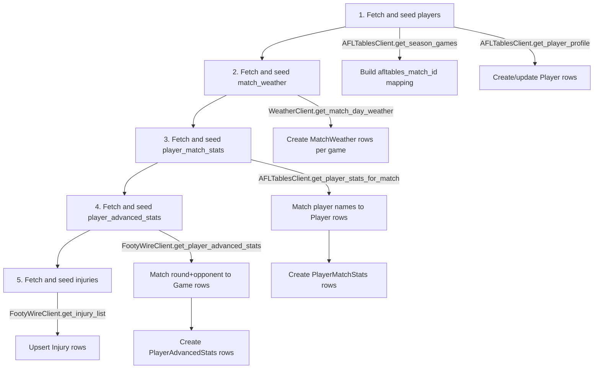

# DB Schema Design: Weather, Player Stats, and Injury Data

> **DESIGN HISTORY — superseded by current implementation.**  This plan was written during the
> `backend-faas` era.  The directory has since been renamed to `backend/`. Paths like
> `backend-faas/...` should be read as `backend/...` today.  Current schema lives in
> [`backend/alembic/versions/`](../backend/alembic/versions/) and is documented in
> [`docs/migrations.md`](../docs/migrations.md).
>
> **⚠️ HISTORICAL DOCUMENT** — This plan was written during the `backend-faas` era.
> The directory has since been renamed to `backend/`. Paths like `backend-faas/...` should be read as `backend/...` today.

**Branch:** `feature/data-scraping-clients`
**Date:** 2026-06-10
**Status:** Draft — pending approval

---

## 1. Context & Design Principles

### Existing Conventions (from [`0001_consolidated`](backend-faas/alembic/versions/2026_05_28_1613-0001_consolidated_postgresql_schema.py))

| Convention | Example |
|---|---|
| PKs | `sa.Column("id", sa.Integer(), nullable=False)` + `PrimaryKeyConstraint("id")` |
| Timestamps | `DateTime(timezone=True)` with `server_default=sa.text("now()")` |
| Unique constraints | Named `uq_{table}_{columns}` |
| Indexes | Created separately via `op.create_index("ix_{table}_{col}", ...)` |
| FKs | `ForeignKeyConstraint(["game_id"], ["games.id"], ondelete="CASCADE")` |
| ORM models | `Column()` style with [`Base`](backend-faas/packages/shared/db.py:9) declarative base |

### New Data Sources

| Source | Client | Key Output |
|---|---|---|
| Open-Meteo | [`WeatherClient`](backend-faas/packages/shared/weather/client.py:32) | Hourly weather by venue + date |
| AFL Tables | [`AFLTablesClient`](backend-faas/packages/shared/afl_data/tables_client.py:17) | Per-match player stats, season games, player bios |
| FootyWire | [`FootyWireClient`](backend-faas/packages/shared/afl_data/footywire_client.py:17) | Advanced stats, injuries, team selections |

### Key Design Decisions

1. **Add `afltables_match_id` to `games`** — the AFL Tables match ID (e.g., `"2025060101"`) is needed to link scraped data to our games table. This is a property of the game, not of any child table.
2. **`players` is the foundation** — all player-related tables FK to it. We use `afltables_id` as the primary cross-reference since AFL Tables is our main stats source.
3. **JSONB for raw hourly weather** — the Open-Meteo match-window data is variable-length hourly arrays. JSONB avoids a separate `weather_hourly` table and lets us query specific hours.
4. **Injuries use upsert pattern** — FootyWire injury list is a snapshot, not a history. We update existing entries for the same player+injury combo.
5. **Player name matching is fuzzy** — the match stats parser only returns `name` from AFL Tables, not the `afltables_id`. We'll match by `(name, team)` initially and backfill `afltables_id` from profile scrapes.

---

## 2. Entity Relationship Diagram

```mermaid
erDiagram
    games ||--o| match_weather : has
    games ||--o{ player_match_stats : has
    games ||--o{ player_advanced_stats : has
    players ||--o{ player_match_stats : plays_in
    players ||--o{ player_advanced_stats : plays_in
    players ||--o{ injuries : has

    games {
        int id PK
        string slug UK
        int squiggle_id UK
        string afltables_match_id
        int round_id
        int season
        string home_team
        string away_team
        int home_score
        int away_score
        string venue
        datetime date
        boolean completed
    }

    match_weather {
        int id PK
        int game_id FK UK
        string venue
        date match_date
        float temperature
        float precipitation
        float wind_speed
        int wind_direction
        float wind_gusts
        int humidity
        int weather_code
        string data_type
        jsonb raw_hourly
        datetime created_at
        datetime updated_at
    }

    players {
        int id PK
        string name UK
        string afltables_id UK
        int footywire_id UK
        string current_team
        string position
        string height
        string weight
        date date_of_birth
        string draft_info
        datetime created_at
        datetime updated_at
    }

    player_match_stats {
        int id PK
        int game_id FK
        int player_id FK
        string team
        int kicks
        int handballs
        int disposals
        int marks
        int goals
        int behinds
        int tackles
        int hitouts
        int frees_for
        int frees_against
    }

    player_advanced_stats {
        int id PK
        int game_id FK
        int player_id FK
        string round_label
        string opponent
        float tog_pct
        int metres_gained
        int score_involvements
        int contested_possessions
        int pressure_acts
        datetime created_at
    }

    injuries {
        int id PK
        int player_id FK
        string team
        string injury_type
        string return_timeline
        string source
        datetime scraped_at
        datetime created_at
        datetime updated_at
    }
```

---

## 3. Table Schemas

### 3.1 Column Addition to `games`

We need to add `afltables_match_id` to the existing [`games`](backend-faas/packages/shared/models/__init__.py:8) table so AFL Tables data can be linked.

| Column | Type | Nullable | Default | Notes |
|---|---|---|---|---|
| `afltables_match_id` | `Text` | Yes | — | AFL Tables match ID, e.g. `"2025060101"` |

**Constraints:** `UniqueConstraint("afltables_match_id", name="uq_games_afltables_match_id")`
**Index:** `ix_games_afltables_match_id`

---

### 3.2 `match_weather`

Stores weather data for each game. One-to-one with `games`.

| Column | Type | Nullable | Default | Notes |
|---|---|---|---|---|
| `id` | `Integer` | No | — | PK |
| `game_id` | `Integer` | No | — | FK → `games.id` ON DELETE CASCADE |
| `venue` | `Text` | Yes | — | Canonical venue name |
| `match_date` | `Date` | Yes | — | Date of the match |
| `temperature` | `Float` | Yes | — | Temperature at match hour in °C |
| `precipitation` | `Float` | Yes | — | Precipitation at match hour in mm |
| `wind_speed` | `Float` | Yes | — | Wind speed at 10m in km/h |
| `wind_direction` | `Integer` | Yes | — | Wind direction in degrees |
| `wind_gusts` | `Float` | Yes | — | Wind gusts at 10m in km/h |
| `humidity` | `Integer` | Yes | — | Relative humidity at 2m in % |
| `weather_code` | `Integer` | Yes | — | WMO weather code |
| `data_type` | `Text` | Yes | `'historical'` | Either `historical` or `forecast` |
| `raw_hourly` | `JSONB` | Yes | — | Full hourly match-window data from Open-Meteo |
| `created_at` | `DateTime(tz=True)` | Yes | `now()` | |
| `updated_at` | `DateTime(tz=True)` | Yes | — | |

**Constraints:**
- `PrimaryKeyConstraint("id")`
- `UniqueConstraint("game_id", name="uq_match_weather_game_id")`
- `ForeignKeyConstraint(["game_id"], ["games.id"], ondelete="CASCADE")`

**Indexes:**
- `ix_match_weather_id` on `id`
- `ix_match_weather_game_id` on `game_id` (unique)
- `ix_match_weather_venue` on `venue`
- `ix_match_weather_data_type` on `data_type`

**Why JSONB for `raw_hourly`?** The Open-Meteo API returns variable-length hourly arrays (time, temperature, precipitation, etc.) for a ±2-hour match window. JSONB lets us:
- Store the full raw data for backtesting
- Query specific hours with PostgreSQL JSON operators
- Avoid a separate `weather_hourly` table with 5-7 rows per game

---

### 3.3 `players`

Master player registry. Independent table (no FKs to other tables).

| Column | Type | Nullable | Default | Notes |
|---|---|---|---|---|
| `id` | `Integer` | No | — | PK |
| `name` | `Text` | No | — | Full player name as scraped from AFL Tables |
| `afltables_id` | `Text` | Yes | — | AFL Tables player path, e.g. `"01A/Champion_Data"` |
| `footywire_id` | `Integer` | Yes | — | FootyWire numeric player ID |
| `current_team` | `Text` | Yes | — | Current AFL team name |
| `position` | `Text` | Yes | — | Position: Forward, Midfield, Defender, Ruck, etc. |
| `height` | `Text` | Yes | — | Height as scraped, e.g. `"185cm"` |
| `weight` | `Text` | Yes | — | Weight as scraped, e.g. `"83kg"` |
| `date_of_birth` | `Date` | Yes | — | Parsed from AFL Tables profile |
| `draft_info` | `Text` | Yes | — | Draft info as scraped |
| `created_at` | `DateTime(tz=True)` | Yes | `now()` | |
| `updated_at` | `DateTime(tz=True)` | Yes | — | |

**Constraints:**
- `PrimaryKeyConstraint("id")`
- `UniqueConstraint("name", name="uq_players_name")` — names are unique in AFL
- `UniqueConstraint("afltables_id", name="uq_players_afltables_id")` — where not null

**Indexes:**
- `ix_players_id` on `id`
- `ix_players_name` on `name` (unique)
- `ix_players_afltables_id` on `afltables_id` (unique)
- `ix_players_footywire_id` on `footywire_id`
- `ix_players_current_team` on `current_team`

**Trade-off on name uniqueness:** AFL player names are practically unique (the league maintains ~750 listed players at any time). In the rare case of duplicate names, we'd append a suffix. This is simpler than a composite key on `(name, date_of_birth)`.

---

### 3.4 `player_match_stats`

Per-game player statistics from AFL Tables. Links to both `games` and `players`.

| Column | Type | Nullable | Default | Notes |
|---|---|---|---|---|
| `id` | `Integer` | No | — | PK |
| `game_id` | `Integer` | No | — | FK → `games.id` ON DELETE CASCADE |
| `player_id` | `Integer` | No | — | FK → `players.id` ON DELETE CASCADE |
| `team` | `Text` | Yes | — | Team the player played for in this game |
| `kicks` | `Integer` | Yes | `0` | |
| `handballs` | `Integer` | Yes | `0` | |
| `disposals` | `Integer` | Yes | `0` | Kicks + Handballs |
| `marks` | `Integer` | Yes | `0` | |
| `goals` | `Integer` | Yes | `0` | |
| `behinds` | `Integer` | Yes | `0` | |
| `tackles` | `Integer` | Yes | `0` | |
| `hitouts` | `Integer` | Yes | `0` | |
| `frees_for` | `Integer` | Yes | `0` | |
| `frees_against` | `Integer` | Yes | `0` | |

**Constraints:**
- `PrimaryKeyConstraint("id")`
- `UniqueConstraint("game_id", "player_id", name="uq_pms_game_player")`
- `ForeignKeyConstraint(["game_id"], ["games.id"], ondelete="CASCADE")`
- `ForeignKeyConstraint(["player_id"], ["players.id"], ondelete="CASCADE")`

**Indexes:**
- `ix_player_match_stats_id` on `id`
- `ix_player_match_stats_game_id` on `game_id`
- `ix_player_match_stats_player_id` on `player_id`
- `ix_player_match_stats_team` on `team`

**Row volume estimate:** ~44 players per game × ~200 games/season = ~8,800 rows/season. For 16 seasons of historical data = ~140K rows. Very manageable for PostgreSQL.

---

### 3.5 `player_advanced_stats`

Advanced per-game metrics from FootyWire. Links to both `games` and `players`.

| Column | Type | Nullable | Default | Notes |
|---|---|---|---|---|
| `id` | `Integer` | No | — | PK |
| `game_id` | `Integer` | No | — | FK → `games.id` ON DELETE CASCADE |
| `player_id` | `Integer` | No | — | FK → `players.id` ON DELETE CASCADE |
| `round_label` | `Text` | Yes | — | Round as displayed by FootyWire, e.g. `"R1"` |
| `opponent` | `Text` | Yes | — | Opponent team abbreviation |
| `tog_pct` | `Float` | Yes | — | Time on ground percentage |
| `metres_gained` | `Integer` | Yes | — | |
| `score_involvements` | `Integer` | Yes | — | |
| `contested_possessions` | `Integer` | Yes | — | |
| `pressure_acts` | `Integer` | Yes | — | Placeholder for future data |
| `created_at` | `DateTime(tz=True)` | Yes | `now()` | |

**Constraints:**
- `PrimaryKeyConstraint("id")`
- `UniqueConstraint("game_id", "player_id", name="uq_pas_game_player")`
- `ForeignKeyConstraint(["game_id"], ["games.id"], ondelete="CASCADE")`
- `ForeignKeyConstraint(["player_id"], ["players.id"], ondelete="CASCADE")`

**Indexes:**
- `ix_player_advanced_stats_id` on `id`
- `ix_player_advanced_stats_game_id` on `game_id`
- `ix_player_advanced_stats_player_id` on `player_id`

**Note:** Linking FootyWire data to our `games` table requires matching `round_label` + `opponent` + `season` → `game_id`. This matching happens in the seeding/application layer, not in the DB.

---

### 3.6 `injuries`

Current injury status for players. Updated on each scrape.

| Column | Type | Nullable | Default | Notes |
|---|---|---|---|---|
| `id` | `Integer` | No | — | PK |
| `player_id` | `Integer` | Yes | — | FK → `players.id` ON DELETE CASCADE; nullable for unmatched players |
| `player_name` | `Text` | No | — | Player name as scraped from FootyWire |
| `team` | `Text` | Yes | — | Team name |
| `injury_type` | `Text` | Yes | — | Description of injury |
| `return_timeline` | `Text` | Yes | — | Expected return, e.g. `"2-3 weeks"`, `"TBC"` |
| `source` | `Text` | Yes | `'footywire'` | Data source identifier |
| `scraped_at` | `DateTime(tz=True)` | No | `now()` | When this data was scraped |
| `created_at` | `DateTime(tz=True)` | Yes | `now()` | First time this injury was recorded |
| `updated_at` | `DateTime(tz=True)` | Yes | — | Last update |

**Constraints:**
- `PrimaryKeyConstraint("id")`
- `ForeignKeyConstraint(["player_id"], ["players.id"], ondelete="CASCADE")`
- `UniqueConstraint("player_name", "injury_type", name="uq_injuries_player_injury")`

**Indexes:**
- `ix_injuries_id` on `id`
- `ix_injuries_player_id` on `player_id`
- `ix_injuries_team` on `team`
- `ix_injuries_scraped_at` on `scraped_at`

**Why `player_name` instead of just `player_id`?** FootyWire injury list gives us `player` as a name string. The player may not exist in our `players` table yet (e.g., a first-year player with no AFL Tables data). We store `player_name` directly and set `player_id` when we can match it. The unique constraint is on `(player_name, injury_type)` to support upsert.

---

## 4. Alembic Migration Code

The migration will be created at:
`backend-faas/alembic/versions/2026_06_10_XXXX-0002_weather_players_injuries.py`

```python
"""Add weather, players, and injury data tables

Revision ID: 0002_weather_players_injuries
Revises: 0001_consolidated
Create Date: 2026-06-10 06:00:00.000000
"""
from typing import Sequence, Union

from alembic import op
import sqlalchemy as sa
from sqlalchemy.dialects.postgresql import JSONB


# revision identifiers, used by Alembic.
revision: str = "0002_weather_players_injuries"
down_revision: Union[str, Sequence[str], None] = "0001_consolidated"
branch_labels: Union[str, Sequence[str], None] = None
depends_on: Union[str, Sequence[str], None] = None


def upgrade() -> None:
    """Add afltables_match_id to games, plus 5 new tables."""

    # ------------------------------------------------------------------
    # 0. Add afltables_match_id column to existing games table
    # ------------------------------------------------------------------
    op.add_column(
        "games",
        sa.Column("afltables_match_id", sa.Text(), nullable=True),
    )
    op.create_unique_constraint(
        "uq_games_afltables_match_id", "games", ["afltables_match_id"]
    )
    op.create_index(
        "ix_games_afltables_match_id", "games", ["afltables_match_id"], unique=True
    )

    # ------------------------------------------------------------------
    # 1. match_weather
    #    FK → games.id with ON DELETE CASCADE. One-to-one with games.
    # ------------------------------------------------------------------
    op.create_table(
        "match_weather",
        sa.Column("id", sa.Integer(), nullable=False),
        sa.Column("game_id", sa.Integer(), nullable=False),
        sa.Column("venue", sa.Text(), nullable=True),
        sa.Column("match_date", sa.Date(), nullable=True),
        sa.Column("temperature", sa.Float(), nullable=True),
        sa.Column("precipitation", sa.Float(), nullable=True),
        sa.Column("wind_speed", sa.Float(), nullable=True),
        sa.Column("wind_direction", sa.Integer(), nullable=True),
        sa.Column("wind_gusts", sa.Float(), nullable=True),
        sa.Column("humidity", sa.Integer(), nullable=True),
        sa.Column("weather_code", sa.Integer(), nullable=True),
        sa.Column(
            "data_type",
            sa.Text(),
            nullable=True,
            server_default=sa.text("'historical'"),
        ),
        sa.Column("raw_hourly", JSONB, nullable=True),
        sa.Column(
            "created_at",
            sa.DateTime(timezone=True),
            server_default=sa.text("now()"),
            nullable=True,
        ),
        sa.Column("updated_at", sa.DateTime(timezone=True), nullable=True),
        sa.ForeignKeyConstraint(["game_id"], ["games.id"], ondelete="CASCADE"),
        sa.PrimaryKeyConstraint("id"),
        sa.UniqueConstraint("game_id", name="uq_match_weather_game_id"),
    )
    op.create_index("ix_match_weather_id", "match_weather", ["id"], unique=False)
    op.create_index(
        "ix_match_weather_game_id", "match_weather", ["game_id"], unique=True
    )
    op.create_index("ix_match_weather_venue", "match_weather", ["venue"], unique=False)
    op.create_index(
        "ix_match_weather_data_type", "match_weather", ["data_type"], unique=False
    )

    # ------------------------------------------------------------------
    # 2. players
    #    No FK dependencies. Master player registry.
    # ------------------------------------------------------------------
    op.create_table(
        "players",
        sa.Column("id", sa.Integer(), nullable=False),
        sa.Column("name", sa.Text(), nullable=False),
        sa.Column("afltables_id", sa.Text(), nullable=True),
        sa.Column("footywire_id", sa.Integer(), nullable=True),
        sa.Column("current_team", sa.Text(), nullable=True),
        sa.Column("position", sa.Text(), nullable=True),
        sa.Column("height", sa.Text(), nullable=True),
        sa.Column("weight", sa.Text(), nullable=True),
        sa.Column("date_of_birth", sa.Date(), nullable=True),
        sa.Column("draft_info", sa.Text(), nullable=True),
        sa.Column(
            "created_at",
            sa.DateTime(timezone=True),
            server_default=sa.text("now()"),
            nullable=True,
        ),
        sa.Column("updated_at", sa.DateTime(timezone=True), nullable=True),
        sa.PrimaryKeyConstraint("id"),
        sa.UniqueConstraint("name", name="uq_players_name"),
        sa.UniqueConstraint("afltables_id", name="uq_players_afltables_id"),
    )
    op.create_index("ix_players_id", "players", ["id"], unique=False)
    op.create_index("ix_players_name", "players", ["name"], unique=True)
    op.create_index("ix_players_afltables_id", "players", ["afltables_id"], unique=True)
    op.create_index(
        "ix_players_footywire_id", "players", ["footywire_id"], unique=False
    )
    op.create_index(
        "ix_players_current_team", "players", ["current_team"], unique=False
    )

    # ------------------------------------------------------------------
    # 3. player_match_stats
    #    FK → games.id, FK → players.id with ON DELETE CASCADE.
    # ------------------------------------------------------------------
    op.create_table(
        "player_match_stats",
        sa.Column("id", sa.Integer(), nullable=False),
        sa.Column("game_id", sa.Integer(), nullable=False),
        sa.Column("player_id", sa.Integer(), nullable=False),
        sa.Column("team", sa.Text(), nullable=True),
        sa.Column(
            "kicks", sa.Integer(), nullable=True, server_default=sa.text("0")
        ),
        sa.Column(
            "handballs", sa.Integer(), nullable=True, server_default=sa.text("0")
        ),
        sa.Column(
            "disposals", sa.Integer(), nullable=True, server_default=sa.text("0")
        ),
        sa.Column(
            "marks", sa.Integer(), nullable=True, server_default=sa.text("0")
        ),
        sa.Column(
            "goals", sa.Integer(), nullable=True, server_default=sa.text("0")
        ),
        sa.Column(
            "behinds", sa.Integer(), nullable=True, server_default=sa.text("0")
        ),
        sa.Column(
            "tackles", sa.Integer(), nullable=True, server_default=sa.text("0")
        ),
        sa.Column(
            "hitouts", sa.Integer(), nullable=True, server_default=sa.text("0")
        ),
        sa.Column(
            "frees_for", sa.Integer(), nullable=True, server_default=sa.text("0")
        ),
        sa.Column(
            "frees_against", sa.Integer(), nullable=True, server_default=sa.text("0")
        ),
        sa.ForeignKeyConstraint(["game_id"], ["games.id"], ondelete="CASCADE"),
        sa.ForeignKeyConstraint(["player_id"], ["players.id"], ondelete="CASCADE"),
        sa.PrimaryKeyConstraint("id"),
        sa.UniqueConstraint("game_id", "player_id", name="uq_pms_game_player"),
    )
    op.create_index(
        "ix_player_match_stats_id", "player_match_stats", ["id"], unique=False
    )
    op.create_index(
        "ix_player_match_stats_game_id", "player_match_stats", ["game_id"], unique=False
    )
    op.create_index(
        "ix_player_match_stats_player_id",
        "player_match_stats",
        ["player_id"],
        unique=False,
    )
    op.create_index(
        "ix_player_match_stats_team", "player_match_stats", ["team"], unique=False
    )

    # ------------------------------------------------------------------
    # 4. player_advanced_stats
    #    FK → games.id, FK → players.id with ON DELETE CASCADE.
    # ------------------------------------------------------------------
    op.create_table(
        "player_advanced_stats",
        sa.Column("id", sa.Integer(), nullable=False),
        sa.Column("game_id", sa.Integer(), nullable=False),
        sa.Column("player_id", sa.Integer(), nullable=False),
        sa.Column("round_label", sa.Text(), nullable=True),
        sa.Column("opponent", sa.Text(), nullable=True),
        sa.Column("tog_pct", sa.Float(), nullable=True),
        sa.Column("metres_gained", sa.Integer(), nullable=True),
        sa.Column("score_involvements", sa.Integer(), nullable=True),
        sa.Column("contested_possessions", sa.Integer(), nullable=True),
        sa.Column("pressure_acts", sa.Integer(), nullable=True),
        sa.Column(
            "created_at",
            sa.DateTime(timezone=True),
            server_default=sa.text("now()"),
            nullable=True,
        ),
        sa.ForeignKeyConstraint(["game_id"], ["games.id"], ondelete="CASCADE"),
        sa.ForeignKeyConstraint(["player_id"], ["players.id"], ondelete="CASCADE"),
        sa.PrimaryKeyConstraint("id"),
        sa.UniqueConstraint("game_id", "player_id", name="uq_pas_game_player"),
    )
    op.create_index(
        "ix_player_advanced_stats_id", "player_advanced_stats", ["id"], unique=False
    )
    op.create_index(
        "ix_player_advanced_stats_game_id",
        "player_advanced_stats",
        ["game_id"],
        unique=False,
    )
    op.create_index(
        "ix_player_advanced_stats_player_id",
        "player_advanced_stats",
        ["player_id"],
        unique=False,
    )

    # ------------------------------------------------------------------
    # 5. injuries
    #    FK → players.id with ON DELETE CASCADE.
    # ------------------------------------------------------------------
    op.create_table(
        "injuries",
        sa.Column("id", sa.Integer(), nullable=False),
        sa.Column("player_id", sa.Integer(), nullable=True),
        sa.Column("player_name", sa.Text(), nullable=False),
        sa.Column("team", sa.Text(), nullable=True),
        sa.Column("injury_type", sa.Text(), nullable=True),
        sa.Column("return_timeline", sa.Text(), nullable=True),
        sa.Column(
            "source",
            sa.Text(),
            nullable=True,
            server_default=sa.text("'footywire'"),
        ),
        sa.Column("scraped_at", sa.DateTime(timezone=True), nullable=False),
        sa.Column(
            "created_at",
            sa.DateTime(timezone=True),
            server_default=sa.text("now()"),
            nullable=True,
        ),
        sa.Column("updated_at", sa.DateTime(timezone=True), nullable=True),
        sa.ForeignKeyConstraint(["player_id"], ["players.id"], ondelete="CASCADE"),
        sa.PrimaryKeyConstraint("id"),
        sa.UniqueConstraint(
            "player_name", "injury_type", name="uq_injuries_player_injury"
        ),
    )
    op.create_index("ix_injuries_id", "injuries", ["id"], unique=False)
    op.create_index("ix_injuries_player_id", "injuries", ["player_id"], unique=False)
    op.create_index("ix_injuries_team", "injuries", ["team"], unique=False)
    op.create_index("ix_injuries_scraped_at", "injuries", ["scraped_at"], unique=False)


def downgrade() -> None:
    """Drop new tables and column in reverse dependency order."""
    op.drop_table("injuries")
    op.drop_table("player_advanced_stats")
    op.drop_table("player_match_stats")
    op.drop_table("players")
    op.drop_table("match_weather")
    op.drop_index("ix_games_afltables_match_id", table_name="games")
    op.drop_constraint("uq_games_afltables_match_id", "games", type_="unique")
    op.drop_column("games", "afltables_match_id")
```

---

## 5. ORM Models to Add

Add to [`packages/shared/models/__init__.py`](backend-faas/packages/shared/models/__init__.py):

```python
class Player(Base):
    __tablename__ = "players"

    id = Column(Integer, primary_key=True, index=True)
    name = Column(Text, unique=True, nullable=False, index=True)
    afltables_id = Column(Text, unique=True, nullable=True, index=True)
    footywire_id = Column(Integer, nullable=True, index=True)
    current_team = Column(Text, nullable=True, index=True)
    position = Column(Text, nullable=True)
    height = Column(Text, nullable=True)
    weight = Column(Text, nullable=True)
    date_of_birth = Column(Date, nullable=True)
    draft_info = Column(Text, nullable=True)
    created_at = Column(DateTime(timezone=True), server_default=func.now())
    updated_at = Column(DateTime(timezone=True), onupdate=func.now())


class MatchWeather(Base):
    __tablename__ = "match_weather"

    id = Column(Integer, primary_key=True, index=True)
    game_id = Column(Integer, ForeignKey("games.id"), unique=True, nullable=False, index=True)
    venue = Column(Text, nullable=True, index=True)
    match_date = Column(Date, nullable=True)
    temperature = Column(Float, nullable=True)
    precipitation = Column(Float, nullable=True)
    wind_speed = Column(Float, nullable=True)
    wind_direction = Column(Integer, nullable=True)
    wind_gusts = Column(Float, nullable=True)
    humidity = Column(Integer, nullable=True)
    weather_code = Column(Integer, nullable=True)
    data_type = Column(Text, nullable=True, default="historical", index=True)
    raw_hourly = Column(JSONB, nullable=True)
    created_at = Column(DateTime(timezone=True), server_default=func.now())
    updated_at = Column(DateTime(timezone=True), onupdate=func.now())

    game = relationship("Game", backref="weather")


class PlayerMatchStats(Base):
    __tablename__ = "player_match_stats"

    id = Column(Integer, primary_key=True, index=True)
    game_id = Column(Integer, ForeignKey("games.id"), nullable=False, index=True)
    player_id = Column(Integer, ForeignKey("players.id"), nullable=False, index=True)
    team = Column(Text, nullable=True, index=True)
    kicks = Column(Integer, default=0)
    handballs = Column(Integer, default=0)
    disposals = Column(Integer, default=0)
    marks = Column(Integer, default=0)
    goals = Column(Integer, default=0)
    behinds = Column(Integer, default=0)
    tackles = Column(Integer, default=0)
    hitouts = Column(Integer, default=0)
    frees_for = Column(Integer, default=0)
    frees_against = Column(Integer, default=0)

    __table_args__ = (
        UniqueConstraint("game_id", "player_id", name="uq_pms_game_player"),
    )

    game = relationship("Game", backref="player_stats")
    player = relationship("Player", backref="match_stats")


class PlayerAdvancedStats(Base):
    __tablename__ = "player_advanced_stats"

    id = Column(Integer, primary_key=True, index=True)
    game_id = Column(Integer, ForeignKey("games.id"), nullable=False, index=True)
    player_id = Column(Integer, ForeignKey("players.id"), nullable=False, index=True)
    round_label = Column(Text, nullable=True)
    opponent = Column(Text, nullable=True)
    tog_pct = Column(Float, nullable=True)
    metres_gained = Column(Integer, nullable=True)
    score_involvements = Column(Integer, nullable=True)
    contested_possessions = Column(Integer, nullable=True)
    pressure_acts = Column(Integer, nullable=True)
    created_at = Column(DateTime(timezone=True), server_default=func.now())

    __table_args__ = (
        UniqueConstraint("game_id", "player_id", name="uq_pas_game_player"),
    )

    game = relationship("Game", backref="advanced_stats")
    player = relationship("Player", backref="advanced_stats")


class Injury(Base):
    __tablename__ = "injuries"

    id = Column(Integer, primary_key=True, index=True)
    player_id = Column(Integer, ForeignKey("players.id"), nullable=True, index=True)
    player_name = Column(Text, nullable=False)
    team = Column(Text, nullable=True, index=True)
    injury_type = Column(Text, nullable=True)
    return_timeline = Column(Text, nullable=True)
    source = Column(Text, default="footywire")
    scraped_at = Column(DateTime(timezone=True), nullable=False)
    created_at = Column(DateTime(timezone=True), server_default=func.now())
    updated_at = Column(DateTime(timezone=True), onupdate=func.now())

    __table_args__ = (
        UniqueConstraint("player_name", "injury_type", name="uq_injuries_player_injury"),
    )

    player = relationship("Player", backref="injuries")
```

---

## 6. Seeding Script Design

### 6.1 New File: `backend-faas/scripts/seed_player_data.py`

A dedicated script for fetching and persisting data from the three new clients.

### 6.2 Order of Operations



### 6.3 Detailed Steps

#### Step 1: Players
```
For each season (2010–current):
    games = AFLTablesClient.get_season_games(year)
    For each game in games:
        stats = AFLTablesClient.get_player_stats_for_match(game.game_id)
        For each player in stats.home_players + stats.away_players:
            IF player.name NOT IN players table:
                INSERT INTO players (name, current_team)
                Optionally: AFLTablesClient.get_player_profile(player_id) for bio data
```

**Error handling:** Skip individual players on parse errors. Log and continue.

#### Step 2: Match Weather
```
For each game in games table (where venue IS NOT NULL):
    weather = WeatherClient.get_match_day_weather(game.venue, game.date)
    IF weather is not empty:
        Extract match-hour values from hourly data
        INSERT INTO match_weather (game_id, venue, match_date, temperature, ...)
        Store raw_hourly as JSONB
```

**Error handling:** Skip games where venue is unknown or API returns empty. Use `data_type='forecast'` for future games.

#### Step 3: Player Match Stats
```
For each game in games table (where completed = true):
    afl_id = game.afltables_match_id  # or fetch from AFL Tables season page
    IF afl_id is None:
        continue
    stats = AFLTablesClient.get_player_stats_for_match(afl_id)
    For each player in stats.home_players + stats.away_players:
        player_row = SELECT id FROM players WHERE name = player.name
        IF player_row exists:
            INSERT INTO player_match_stats (game_id, player_id, team, kicks, ...)
```

**Error handling:** Skip unmatched players (log warning). Use ON CONFLICT for idempotency.

#### Step 4: Player Advanced Stats
```
For each player in players table (WHERE footywire_id IS NOT NULL):
    stats = FootyWireClient.get_player_advanced_stats(player.footywire_id, season)
    For each round_stats in stats:
        Match round_stats.round + round_stats.opponent → game in games table
        IF matched:
            INSERT INTO player_advanced_stats (...)
```

**Error handling:** Skip rounds that don't match a game. Log mismatches.

#### Step 5: Injuries
```
injuries = FootyWireClient.get_injury_list()
scraped_at = now()

For each injury in injuries:
    player_row = SELECT id FROM players WHERE name ILIKE injury.player
    Upsert INTO injuries (player_id, player_name, team, injury_type, return_timeline, scraped_at)
    ON CONFLICT (player_name, injury_type) DO UPDATE SET
        return_timeline = EXCLUDED.return_timeline,
        scraped_at = EXCLUDED.scraped_at,
        updated_at = now()
```

**Error handling:** Always upsert. Set `player_id = NULL` if no match found.

### 6.4 Idempotency Strategy

- All inserts use `ON CONFLICT ... DO NOTHING` or `DO UPDATE` (upsert)
- The seed script can be run multiple times safely
- A `--season` flag limits which seasons to process
- A `--table` flag limits which tables to seed (for targeted runs)
- A `--clear` flag truncates the new tables before seeding

### 6.5 Integration with Existing Scripts

Update [`seed_data.py`](backend-faas/scripts/seed_data.py) to include:
- New ORM model imports
- `clear_all_data` additions in FK-safe order
- Optional generation of synthetic player/weather data for dev

Update [`migrate_and_seed.py`](backend-faas/scripts/migrate_and_seed.py) to include:
- New `_SEED_TABLES` entries in FK-safe order
- New `_CLEAR_TABLES` entries

---

## 7. Files to Create/Modify

| Action | File | Description |
|---|---|---|
| **Create** | `backend-faas/alembic/versions/2026_06_10_XXXX-0002_weather_players_injuries.py` | Alembic migration |
| **Modify** | `backend-faas/packages/shared/models/__init__.py` | Add 5 new ORM models + update Game model |
| **Modify** | `backend-faas/scripts/seed_data.py` | Add synthetic seed data for new tables |
| **Modify** | `backend-faas/scripts/migrate_and_seed.py` | Add new tables to seed order |
| **Create** | `backend-faas/scripts/seed_player_data.py` | New live-data seeding script |
| **Create** | `backend-faas/tests/unit/test_seed_player_data.py` | Tests for the new seed script |
| **Create** | `backend-faas/tests/unit/test_new_models.py` | Tests for new ORM models |

---

## 8. Concerns & Trade-offs

| Concern | Mitigation |
|---|---|
| **Player name matching is fragile** | AFL player names are practically unique. We log warnings on failures and support manual backfill via `afltables_id`. |
| **FootyWire → game matching is indirect** | We match by `round_label` + `opponent` + `season`. Some edge cases (draws, venue changes) may not match. Log and skip. |
| **JSONB for raw_hourly is PostgreSQL-specific** | We're already committed to PostgreSQL (Alembic migrations, asyncpg). This is acceptable. |
| **Injuries table uses `player_name` not `player_id` as UK** | Allows recording injuries for players not yet in the `players` table. `player_id` is set when a match is found. |
| **No `player_team_history` table** | Team changes across seasons are tracked implicitly via `player_match_stats.team`. A separate history table can be added later if needed. |
| **Large historical data volumes** | ~140K player_match_stats rows for 16 seasons is manageable. We add appropriate indexes for common query patterns. |
| **`afltables_match_id` column addition to `games`** | This is a nullable column with no data — safe migration. Populated during seeding. |
