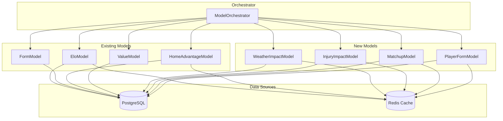

# New Prediction Models — Architecture Document

> **DESIGN HISTORY — superseded by current implementation.**  All four models in this
> plan (Weather, Injury, Matchup, Player Form) are now live in
> [`backend/packages/shared/models_ml/`](../backend/packages/shared/models_ml/).  The
> production ML stack is documented in [`docs/api.md`](../docs/api.md#ml-models).
>
> **⚠️ HISTORICAL DOCUMENT** — This plan was written during the `backend-faas` era.
> The directory has since been renamed to `backend/`. Paths like `backend-faas/...` should be read as `backend/...` today.

## Overview

This document describes the design of 4 new prediction models for the AFL tipping system. Each model extends [`BaseModel`](backend-faas/packages/shared/models_ml/base.py:7) and integrates with the existing [`ModelOrchestrator`](backend-faas/packages/shared/orchestrator.py:14).

### Design Principles

- **Pure Python only** — no NumPy, scikit-learn, or heavy dependencies
- **Backtest-safe** — all queries filter on `Game.date < game.date` to prevent data leakage
- **Cold-start graceful** — each model returns sensible defaults when insufficient data exists
- **Redis-cached** — follow the pattern established by [`HomeAdvantageModel`](backend-faas/packages/shared/models_ml/home_advantage.py:19) for per-prediction caching

### Existing Model Return Contract

All models return `Tuple[str, float, int]`:
- `winner_team: str` — predicted winner team name
- `confidence: float` — 0.50–0.95 range
- `predicted_margin: int` — 1–100 range

---

## Architecture Diagram



---

## 1. WeatherImpactModel

**Model name:** `weather_impact`
**File:** `backend-faas/packages/shared/models_ml/weather_impact.py`

### Concept

Uses historical weather data to determine how specific conditions affect game outcomes. AFL is an outdoor sport where rain, wind, and extreme temperatures significantly impact scoring and game style. The model learns from historical games played in similar weather conditions.

### Algorithm

1. **Fetch forecast weather** for the upcoming game from `match_weather` table
2. **Classify conditions** into one of 4 weather tiers based on composite score
3. **Query historical win rates** for each team under similar conditions
4. **Compare team weather resilience** to produce prediction

#### Weather Tier Classification

```python
def _classify_weather(self, weather: MatchWeather) -> str:
    """Classify weather into a tier based on composite conditions."""
    score = 0.0
    
    # Precipitation impact - 0 to 5mm is light, >5mm is heavy
    if weather.precipitation is not None:
        if weather.precipitation > 5.0:
            score += 2.0
        elif weather.precipitation > 1.0:
            score += 1.0
    
    # Wind impact - gusts over 40km/h are significant
    if weather.wind_gusts is not None:
        if weather.wind_gusts > 50.0:
            score += 2.0
        elif weather.wind_gusts > 35.0:
            score += 1.0
    
    # Temperature extremes
    if weather.temperature is not None:
        if weather.temperature > 35.0 or weather.temperature < 10.0:
            score += 1.0
    
    if score >= 3.0:
        return "poor"
    elif score >= 2.0:
        return "challenging"
    elif score >= 1.0:
        return "moderate"
    else:
        return "good"
```

### SQLAlchemy Queries

#### Query 1: Get weather for the current game

```python
from ..models import Game, MatchWeather

result = await db.execute(
    select(MatchWeather)
    .where(MatchWeather.game_id == game.id)
)
weather = result.scalars().first()
```

#### Query 2: Historical team performance in similar weather tier

```python
from sqlalchemy import func, case, and_

# Get all completed games with weather data for the home team
# where the weather was similar to current conditions
home_result = await db.execute(
    select(
        func.count().label("total"),
        func.sum(
            case(
                (
                    (Game.home_team == team) & (Game.home_score > Game.away_score),
                    1,
                ),
                (
                    (Game.away_team == team) & (Game.away_score > Game.home_score),
                    1,
                ),
                else_=0,
            )
        ).label("wins"),
        func.avg(
            case(
                (Game.home_team == team, Game.home_score),
                else_=Game.away_score,
            )
        ).label("avg_score"),
    )
    .select_from(Game)
    .join(MatchWeather, MatchWeather.game_id == Game.id)
    .where(
        and_(
            Game.completed == True,
            Game.date < game.date,
            (Game.home_team == team) | (Game.away_team == team),
            # Weather tier filter using composite thresholds
            MatchWeather.precipitation <= precipitation_upper,
            MatchWeather.wind_gusts <= wind_upper,
        )
    )
)
```

**Note:** To avoid complex tier-matching in SQL, the model fetches historical weather-game pairs and filters in Python:

```python
# Simpler approach: fetch recent games with weather, classify in Python
result = await db.execute(
    select(Game, MatchWeather)
    .join(MatchWeather, MatchWeather.game_id == Game.id)
    .where(
        and_(
            Game.completed == True,
            Game.date < game.date,
            (Game.home_team == team) | (Game.away_team == team),
        )
    )
    .order_by(Game.date.desc())
    .limit(30)  # Last 30 games with weather data
)
games_with_weather = result.all()

# Filter in Python by weather tier
similar_games = [
    (g, w) for g, w in games_with_weather
    if self._classify_weather(w) == current_tier
]
```

### Confidence and Margin Formulas

```python
# Win rate in similar conditions
home_wr = home_wins / max(home_total, 1)
away_wr = away_wins / max(away_total, 1)

# Weather resilience differential
diff = home_wr - away_wr

# Home weather bonus: home teams in poor conditions get a slight edge
# because they train at the venue and are acclimatised
home_weather_bonus = 0.0
if current_tier in ("poor", "challenging"):
    home_weather_bonus = 0.03  # 3% home advantage bump in bad weather

adjusted_diff = diff + home_weather_bonus

# Winner
if adjusted_diff > 0:
    winner = game.home_team
else:
    winner = game.away_team

# Confidence: base 0.50 + scaled differential
# Scale: each 10% difference in win rate adds ~4% confidence
confidence = 0.50 + min(abs(adjusted_diff) * 0.4, 0.45)

# Margin: proportional to win rate differential and weather severity
weather_severity = {"good": 0.5, "moderate": 0.7, "challenging": 0.9, "poor": 1.2}
severity_mult = weather_severity.get(current_tier, 0.5)
margin = max(1, min(50, int(abs(adjusted_diff) * 100 * severity_mult)))
```

### Cold-Start Behavior

| Condition | Behavior |
|-----------|----------|
| No weather data for current game | Return `(home_team, 0.55, 12)` — slight home lean |
| No historical weather data at all | Return `(home_team, 0.55, 12)` |
| Fewer than 3 similar-condition games for a team | Use overall team win rate from `games` table as fallback |
| Weather data has NULL fields | Classify as "good" tier — missing data defaults to favorable conditions |

### Caching Strategy

```python
_CACHE_PREFIX = "wimt:weather_impact:"
_CACHE_TTL = 1800  # 30 minutes — forecasts update hourly

# Cache key includes game date and team pair
cache_key = f"{_CACHE_PREFIX}{game.date.isoformat()}:{game.home_team}:{game.away_team}"
```

- **Why 30 min TTL:** Forecast weather data updates hourly via Open-Meteo; 30 min balances freshness with DB load
- **Cache content:** Computed `(home_weather_wr, away_weather_wr, current_tier, sample_sizes)`
- **Backtest mode:** Cache is bypassed when `game.date < now - 7 days`

### Integration with Orchestrator

```python
# In ModelOrchestrator.__init__
from .weather_impact import WeatherImpactModel

self.models: List[BaseModel] = [
    EloModel(),
    FormModel(),
    HomeAdvantageModel(),
    ValueModel(),
    WeatherImpactModel(),  # NEW
]
```

---

## 2. InjuryImpactModel

**Model name:** `injury_impact`
**File:** `backend-faas/packages/shared/models_ml/injury_impact.py`

### Concept

Assesses the impact of injured players on team performance. Key players missing through injury can dramatically affect a teams chances. The model quantifies each missing players importance using their historical `player_match_stats` and calculates a team-level impact score.

### Algorithm

1. **Fetch active injuries** for both teams from the `injuries` table
2. **Resolve injured players** to their `player_id` in the `players` table
3. **Calculate player importance** from recent `player_match_stats` — weighted composite of goals, disposals, tackles, and contested possessions
4. **Sum importance** for each team to get total injury impact
5. **Compare impacts** — the team with higher injury burden is penalized

#### Player Importance Score

```python
def _calculate_importance(self, stats: dict) -> float:
    """Calculate a single players importance from their average stats.
    
    Weighted composite that rewards goal-kickers, ball-winners, and
    contested players more heavily.
    
    Scale: ~0-15 for a typical player, ~15-30 for stars.
    """
    return (
        stats.get("avg_goals", 0) * 4.0       # Goals are most impactful
        + stats.get("avg_disposals", 0) * 0.3  # Ball winners
        + stats.get("avg_tackles", 0) * 1.5    # Defensive pressure
        + stats.get("avg_marks", 0) * 0.5      # Field position
        + stats.get("avg_hitouts", 0) * 0.2    # Ruck work
    )
```

### SQLAlchemy Queries

#### Query 1: Get active injuries for both teams

```python
from ..models import Injury, Player

result = await db.execute(
    select(Injury, Player)
    .outerjoin(Player, Player.name == Injury.player_name)
    .where(
        and_(
            Injury.team.in_([game.home_team, game.away_team]),
            Injury.return_timeline != "Available",
            Injury.return_timeline != "Test",
        )
    )
)
injury_data = result.all()
```

#### Query 2: Get recent player stats for injured players with resolved IDs

```python
from ..models import PlayerMatchStats

# Collect player_ids that were resolved
injured_player_ids = [
    player.id for injury, player in injury_data
    if player is not None and player.id is not None
]

if injured_player_ids:
    result = await db.execute(
        select(
            PlayerMatchStats.player_id,
            func.avg(PlayerMatchStats.goals).label("avg_goals"),
            func.avg(PlayerMatchStats.disposals).label("avg_disposals"),
            func.avg(PlayerMatchStats.tackles).label("avg_tackles"),
            func.avg(PlayerMatchStats.marks).label("avg_marks"),
            func.avg(PlayerMatchStats.hitouts).label("avg_hitouts"),
        )
        .join(Game, Game.id == PlayerMatchStats.game_id)
        .where(
            and_(
                PlayerMatchStats.player_id.in_(injured_player_ids),
                Game.completed == True,
                Game.date < game.date,
            )
        )
        .group_by(PlayerMatchStats.player_id)
    )
    player_stats = {row.player_id: row for row in result.all()}
```

#### Query 3: Get team average stats for normalization

```python
# Average team totals per game for context
team_result = await db.execute(
    select(
        PlayerMatchStats.team,
        func.avg(PlayerMatchStats.goals).label("avg_goals"),
        func.avg(PlayerMatchStats.disposals).label("avg_disposals"),
    )
    .join(Game, Game.id == PlayerMatchStats.game_id)
    .where(
        and_(
            PlayerMatchStats.team.in_([game.home_team, game.away_team]),
            Game.completed == True,
            Game.date < game.date,
        )
    )
    .group_by(PlayerMatchStats.team)
)
team_averages = {row.team: row for row in team_result.all()}
```

### Confidence and Margin Formulas

```python
# Calculate total importance lost for each team
home_impact = sum(importance_scores for home team injuries)
away_impact = sum(importance_scores for away team injuries)

# Normalize by team average to get percentage impact
home_avg_goals = team_averages.get(game.home_team, {}).get("avg_goals", 10)
away_avg_goals = team_averages.get(game.away_team, {}).get("avg_goals", 10)

home_impact_pct = home_impact / max(home_avg_goals * 4, 1)  # As % of avg team goals
away_impact_pct = away_impact / max(away_avg_goals * 4, 1)

# Differential: positive means home team is LESS impacted by injuries
diff = away_impact_pct - home_impact_pct

# Winner: team with fewer impactful injuries
if diff > 0:
    winner = game.home_team
else:
    winner = game.away_team

# Confidence: baseline 0.50, scaled by injury differential
# Max boost of ~0.20 from injuries alone
confidence = 0.50 + min(abs(diff) * 0.3, 0.20)

# Margin: proportional to importance difference
margin = max(1, min(40, int(abs(diff) * 25)))
```

### Cold-Start Behavior

| Condition | Behavior |
|-----------|----------|
| No injuries for either team | Return `(home_team, 0.52, 8)` — very slight home lean |
| Injury records exist but player has no stats | Assign default importance of 3.0 — a moderate-impact player |
| No `player_match_stats` table data at all | Return `(home_team, 0.52, 8)` |
| Unable to resolve player name to `players` table | Use injury count × default importance of 3.0 |
| All players marked "Available" or "Test" | Return `(home_team, 0.52, 8)` |

### Caching Strategy

```python
_CACHE_PREFIX = "wimt:injury_impact:"
_CACHE_TTL = 900  # 15 minutes — injury reports update daily

# Cache key: team pair + date
cache_key = f"{_CACHE_PREFIX}{game.home_team}:{game.away_team}:{game.date.isoformat()}"
```

- **Why 15 min TTL:** Injury lists change infrequently — typically updated once daily
- **Cache content:** `{home_impact: float, away_impact: float, home_injured_count: int, away_injured_count: int}`
- **Backtest mode:** Cache bypassed for historical dates

### Integration with Orchestrator

```python
from .injury_impact import InjuryImpactModel

self.models: List[BaseModel] = [
    EloModel(),
    FormModel(),
    HomeAdvantageModel(),
    ValueModel(),
    WeatherImpactModel(),
    InjuryImpactModel(),  # NEW
]
```

---

## 3. MatchupModel

**Model name:** `matchup`
**File:** `backend-faas/packages/shared/models_ml/matchup.py`

### Concept

Head-to-head historical performance between specific team pairs. Some teams historically struggle against particular opponents regardless of overall form — this model captures those matchup-specific dynamics.

### Algorithm

1. **Query head-to-head games** between the two teams, ordered chronologically
2. **Apply exponential time decay** — recent games count more than old ones
3. **Apply venue weighting** — games at the current venue count more
4. **Calculate matchup-adjusted win probability**

#### Time Decay Function

```python
def _time_decay_weight(self, game_date, prediction_date) -> float:
    """Exponential decay: recent games matter more.
    
    Half-life of ~2 years (730 days).
    A game from 2 years ago gets 50% weight.
    A game from 4 years ago gets 25% weight.
    """
    days_diff = (prediction_date - game_date).days
    half_life = 730  # 2 years in days
    return 0.5 ** (days_diff / half_life)
```

### SQLAlchemy Queries

#### Query 1: Head-to-head games between the two teams

```python
result = await db.execute(
    select(Game)
    .where(
        and_(
            Game.completed == True,
            Game.date < game.date,
            (
                (Game.home_team == game.home_team) & (Game.away_team == game.away_team)
                | (Game.home_team == game.away_team) & (Game.away_team == game.home_team)
            ),
        )
    )
    .order_by(Game.date.desc())
    .limit(30)  # Last 30 H2H meetings
)
h2h_games = result.scalars().all()
```

#### Query 2: Head-to-head at the specific venue

```python
venue_result = await db.execute(
    select(Game)
    .where(
        and_(
            Game.completed == True,
            Game.date < game.date,
            Game.venue == game.venue,
            (
                (Game.home_team == game.home_team) & (Game.away_team == game.away_team)
                | (Game.home_team == game.away_team) & (Game.away_team == game.home_team)
            ),
        )
    )
    .order_by(Game.date.desc())
    .limit(15)
)
venue_h2h = venue_result.scalars().all()
```

### Confidence and Margin Formulas

```python
# Weighted wins for home_team across all H2H games
weighted_home_wins = 0.0
total_weight = 0.0

for past_game in h2h_games:
    weight = self._time_decay_weight(past_game.date, game.date)
    
    # Venue bonus: games at current venue get 1.5x weight
    if past_game.venue == game.venue:
        weight *= 1.5
    
    # Determine if home_team won
    if past_game.home_team == game.home_team:
        home_score = past_game.home_score or 0
        away_score = past_game.away_score or 0
    else:
        home_score = past_game.away_score or 0
        away_score = past_game.home_score or 0
    
    if home_score > away_score:
        weighted_home_wins += weight
    
    total_weight += weight

# Weighted win rate
h2h_wr = weighted_home_wins / max(total_weight, 1)

# Margin calculation: average H2H margin weighted by recency
weighted_margin = 0.0
for past_game in h2h_games:
    weight = self._time_decay_weight(past_game.date, game.date)
    if past_game.venue == game.venue:
        weight *= 1.5
    
    if past_game.home_team == game.home_team:
        margin = (past_game.home_score or 0) - (past_game.away_score or 0)
    else:
        margin = (past_game.away_score or 0) - (past_game.home_score or 0)
    
    weighted_margin += margin * weight

avg_weighted_margin = weighted_margin / max(total_weight, 1)

# Prediction
if h2h_wr > 0.50:
    winner = game.home_team
else:
    winner = game.away_team

# Confidence: scaled from 0.50 baseline
# Strong H2H dominance = higher confidence
confidence = 0.50 + min(abs(h2h_wr - 0.50) * 0.8, 0.35)

# Margin: based on historical average, dampened
margin = max(1, min(60, int(abs(avg_weighted_margin) * 0.6)))
```

### Cold-Start Behavior

| Condition | Behavior |
|-----------|----------|
| No H2H games at all | Return `(home_team, 0.53, 10)` — slight home lean |
| Fewer than 3 H2H games | Blend H2H data 50/50 with neutral prediction |
| No H2H games at this venue | Use overall H2H data without venue weighting |
| Only very old H2H data — all weight < 0.1 | Reduce confidence to 0.50–0.55 range |

### Caching Strategy

```python
_CACHE_PREFIX = "wimt:matchup:"
_CACHE_TTL = 3600  # 1 hour — H2H data only changes after games complete

# Cache key: sorted team pair + venue
teams_sorted = sorted([game.home_team, game.away_team])
cache_key = f"{_CACHE_PREFIX}{teams_sorted[0]}:{teams_sorted[1]}:{game.venue}:{game.date.isoformat()}"
```

- **Why 1 hour TTL:** H2H records only change after a game completes — very stable
- **Cache content:** `{h2h_wr: float, avg_weighted_margin: float, game_count: int}`
- **Backtest mode:** Cache bypassed for historical dates

### Integration with Orchestrator

```python
from .matchup import MatchupModel

self.models: List[BaseModel] = [
    EloModel(),
    FormModel(),
    HomeAdvantageModel(),
    ValueModel(),
    WeatherImpactModel(),
    InjuryImpactModel(),
    MatchupModel(),  # NEW
]
```

---

## 4. PlayerFormModel

**Model name:** `player_form`
**File:** `backend-faas/packages/shared/models_ml/player_form.py`

### Concept

Aggregates `player_advanced_stats` to the team level to measure recent team quality. Teams whose players are collectively generating more metres gained, score involvements, and contested possessions are playing better football. This model captures within-season form that basic win/loss records might miss.

### Algorithm

1. **Fetch recent team games** — last 5 completed games for each team
2. **Aggregate `player_advanced_stats`** per team per game
3. **Calculate team form metrics** — weighted average of key advanced stats
4. **Compare team form scores** to produce prediction

#### Team Form Score Formula

```python
def _calculate_team_form_score(self, team_games_stats: list) -> float:
    """Calculate a composite form score from aggregated advanced stats.
    
    Components are weighted by their correlation with winning:
    - Score involvements: most correlated with winning
    - Metres gained: field position dominance
    - Contested possessions: winning the ball
    - Pressure acts: defensive effort
    - TOG%: durability and coach trust
    """
    if not team_games_stats:
        return 0.0
    
    total_score = 0.0
    count = 0
    
    for game_stats in team_games_stats:
        # Sum of player-level stats for this team in this game
        game_score = (
            game_stats.get("total_score_involvements", 0) * 2.0
            + game_stats.get("total_metres_gained", 0) * 0.005
            + game_stats.get("total_contested_possessions", 0) * 1.5
            + game_stats.get("total_pressure_acts", 0) * 0.8
            + game_stats.get("avg_tog_pct", 0) * 0.3
        )
        total_score += game_score
        count += 1
    
    return total_score / max(count, 1)
```

### SQLAlchemy Queries

#### Query 1: Get recent game IDs for each team

```python
from ..models import Game, PlayerAdvancedStats, PlayerMatchStats
from sqlalchemy import func

# Recent completed games for home team
home_games_result = await db.execute(
    select(Game.id)
    .where(
        and_(
            Game.completed == True,
            Game.date < game.date,
            (Game.home_team == game.home_team) | (Game.away_team == game.home_team),
        )
    )
    .order_by(Game.date.desc())
    .limit(5)
)
home_game_ids = [row[0] for row in home_games_result.all()]
```

#### Query 2: Aggregate advanced stats per team per game

```python
# Aggregate player_advanced_stats for home team across recent games
home_stats_result = await db.execute(
    select(
        PlayerAdvancedStats.game_id,
        func.sum(PlayerAdvancedStats.score_involvements).label("total_score_involvements"),
        func.sum(PlayerAdvancedStats.metres_gained).label("total_metres_gained"),
        func.sum(PlayerAdvancedStats.contested_possessions).label("total_contested_possessions"),
        func.sum(PlayerAdvancedStats.pressure_acts).label("total_pressure_acts"),
        func.avg(PlayerAdvancedStats.tog_pct).label("avg_tog_pct"),
    )
    .join(Game, Game.id == PlayerAdvancedStats.game_id)
    .join(PlayerMatchStats, and_(
        PlayerMatchStats.game_id == PlayerAdvancedStats.game_id,
        PlayerMatchStats.player_id == PlayerAdvancedStats.player_id,
    ))
    .where(
        and_(
            PlayerAdvancedStats.game_id.in_(home_game_ids),
            PlayerMatchStats.team == game.home_team,  # Only this teams players
            Game.date < game.date,
        )
    )
    .group_by(PlayerAdvancedStats.game_id)
)
home_stats = home_stats_result.all()
```

#### Query 3: Same query for away team

```python
# Identical pattern for away team — get game IDs then aggregate stats
away_games_result = await db.execute(
    select(Game.id)
    .where(
        and_(
            Game.completed == True,
            Game.date < game.date,
            (Game.home_team == game.away_team) | (Game.away_team == game.away_team),
        )
    )
    .order_by(Game.date.desc())
    .limit(5)
)
away_game_ids = [row[0] for row in away_games_result.all()]

away_stats_result = await db.execute(
    select(
        PlayerAdvancedStats.game_id,
        func.sum(PlayerAdvancedStats.score_involvements).label("total_score_involvements"),
        func.sum(PlayerAdvancedStats.metres_gained).label("total_metres_gained"),
        func.sum(PlayerAdvancedStats.contested_possessions).label("total_contested_possessions"),
        func.sum(PlayerAdvancedStats.pressure_acts).label("total_pressure_acts"),
        func.avg(PlayerAdvancedStats.tog_pct).label("avg_tog_pct"),
    )
    .join(Game, Game.id == PlayerAdvancedStats.game_id)
    .join(PlayerMatchStats, and_(
        PlayerMatchStats.game_id == PlayerAdvancedStats.game_id,
        PlayerMatchStats.player_id == PlayerAdvancedStats.player_id,
    ))
    .where(
        and_(
            PlayerAdvancedStats.game_id.in_(away_game_ids),
            PlayerMatchStats.team == game.away_team,
            Game.date < game.date,
        )
    )
    .group_by(PlayerAdvancedStats.game_id)
)
away_stats = away_stats_result.all()
```

### Confidence and Margin Formulas

```python
home_form = self._calculate_team_form_score([self._row_to_dict(r) for r in home_stats])
away_form = self._calculate_team_form_score([self._row_to_dict(r) for r in away_stats])

# Normalize: typical team form scores range ~80-150
# Map to a 0-1 scale using sigmoid-like function
def _normalize_form(self, score: float) -> float:
    """Normalize raw form score to 0-1 range."""
    # Empirical midpoint ~110, std ~20
    midpoint = 110.0
    scale = 30.0
    return 1.0 / (1.0 + 2.71828 ** (-(score - midpoint) / scale))

home_norm = self._normalize_form(home_form)
away_norm = self._normalize_form(away_form)

# Differential
diff = home_norm - away_norm

# Home advantage micro-boost
diff += 0.02

# Winner
if diff > 0:
    winner = game.home_team
else:
    winner = game.away_team

# Confidence: 0.50 base + scaled differential
confidence = 0.50 + min(abs(diff) * 0.6, 0.35)

# Margin: proportional to form differential
margin = max(1, min(55, int(abs(diff) * 80)))
```

### Cold-Start Behavior

| Condition | Behavior |
|-----------|----------|
| No advanced stats data at all | Return `(home_team, 0.52, 10)` |
| Advanced stats exist for only one team | The team with data gets a moderate confidence boost; use default form for the other |
| Fewer than 3 recent games with advanced stats | Blend available data with neutral form score proportionally |
| NULL values in advanced stat fields | Skip those players in aggregation; if >50% of players have NULL, treat as no data for that game |

### Caching Strategy

```python
_CACHE_PREFIX = "wimt:player_form:"
_CACHE_TTL = 1800  # 30 minutes — stats update after each round

# Cache key: team pair + date
cache_key = f"{_CACHE_PREFIX}{game.home_team}:{game.away_team}:{game.date.isoformat()}"
```

- **Why 30 min TTL:** Advanced stats are updated after each round completes — relatively stable between rounds
- **Cache content:** `{home_form: float, away_form: float, home_games: int, away_games: int}`
- **Backtest mode:** Cache bypassed for historical dates

### Integration with Orchestrator

```python
from .player_form import PlayerFormModel

self.models: List[BaseModel] = [
    EloModel(),
    FormModel(),
    HomeAdvantageModel(),
    ValueModel(),
    WeatherImpactModel(),
    InjuryImpactModel(),
    MatchupModel(),
    PlayerFormModel(),  # NEW
]
```

---

## Integration Summary

### Orchestrator Changes

The [`ModelOrchestrator.__init__`](backend-faas/packages/shared/orchestrator.py:17) method needs to include all 4 new models:

```python
# backend-faas/packages/shared/orchestrator.py
from .models_ml import (
    BaseModel,
    EloModel,
    FormModel,
    HomeAdvantageModel,
    ValueModel,
    WeatherImpactModel,   # NEW
    InjuryImpactModel,     # NEW
    MatchupModel,          # NEW
    PlayerFormModel,       # NEW
)

class ModelOrchestrator:
    def __init__(self):
        self.models: List[BaseModel] = [
            EloModel(),
            FormModel(),
            HomeAdvantageModel(),
            ValueModel(),
            WeatherImpactModel(),
            InjuryImpactModel(),
            MatchupModel(),
            PlayerFormModel(),
        ]
        # ... heuristics unchanged
```

### `models_ml/__init__.py` Changes

```python
# backend-faas/packages/shared/models_ml/__init__.py
from .base import BaseModel
from .elo import EloModel
from .form import FormModel
from .home_advantage import HomeAdvantageModel
from .value import ValueModel
from .weather_impact import WeatherImpactModel
from .injury_impact import InjuryImpactModel
from .matchup import MatchupModel
from .player_form import PlayerFormModel

__all__ = [
    "BaseModel",
    "EloModel",
    "FormModel",
    "HomeAdvantageModel",
    "ValueModel",
    "WeatherImpactModel",
    "InjuryImpactModel",
    "MatchupModel",
    "PlayerFormModel",
]
```

### Heuristic Impact

The existing heuristics — [`BestBetHeuristic`](backend-faas/packages/shared/heuristics/best_bet.py:8), `YOLOHeuristic`, `HighRiskHighRewardHeuristic` — work by **voting on model predictions**. Adding 4 more models means:

- **BestBet**: Will now aggregate votes from 8 models instead of 4, producing more stable consensus predictions
- **YOLO**: Will have more diverse predictions to find contrarian picks
- **HighRiskHighReward**: Will have more signal to detect high-variance opportunities

No heuristic code changes required — they already accept any number of models.

### Model Predictions Table

The [`ModelPrediction`](backend-faas/packages/shared/models/__init__.py:50) table stores `model_name` as a `String(50)`. The new model names fit within this constraint:
- `weather_impact` — 15 chars ✓
- `injury_impact` — 13 chars ✓
- `matchup` — 7 chars ✓
- `player_form` — 12 chars ✓

### File Structure

```
backend-faas/packages/shared/models_ml/
├── __init__.py           # Updated with new exports
├── base.py               # Unchanged
├── elo.py                # Unchanged
├── form.py               # Unchanged
├── home_advantage.py     # Unchanged
├── value.py              # Unchanged
├── weather_impact.py     # NEW
├── injury_impact.py      # NEW
├── matchup.py            # NEW
└── player_form.py        # NEW
```

### Error Handling Pattern

All models follow the same error handling pattern as existing models. The orchestrator wraps each model call in [`predict_with_logging`](backend-faas/packages/shared/orchestrator.py:56) which catches any exception and returns a fallback `(home_team, 0.5, 0)`. Each model internally should:

```python
async def predict(self, game: Game, db: AsyncSession) -> Tuple[str, float, int]:
    try:
        # ... model logic
    except Exception as e:
        logger.error(f"{self.get_name()}: Prediction failed: {e}")
        return game.home_team, 0.50, 10  # Safe default
```

### Redis Key Namespace

| Model | Key Pattern | TTL |
|-------|-------------|-----|
| WeatherImpactModel | `wimt:weather_impact:{date}:{home}:{away}` | 30 min |
| InjuryImpactModel | `wimt:injury_impact:{home}:{away}:{date}` | 15 min |
| MatchupModel | `wimt:matchup:{team_a}:{team_b}:{venue}:{date}` | 1 hour |
| PlayerFormModel | `wimt:player_form:{home}:{away}:{date}` | 30 min |

All keys are prefixed with `wimt:` consistent with the existing [`RedisCache`](backend-faas/packages/shared/cache.py:45) convention.

---

## Testing Strategy

### Unit Tests Required

Each model needs a test file at `backend-faas/tests/unit/`:

| Test File | Covers |
|-----------|--------|
| `test_weather_impact_model.py` | Weather tier classification, cold-start, query mock, confidence clamping |
| `test_injury_impact_model.py` | Importance calculation, importance score with no stats, cold-start |
| `test_matchup_model.py` | Time decay weights, venue weighting, H2H with no history, cold-start |
| `test_player_form_model.py` | Form score calculation, normalization, partial data handling, cold-start |

### Test Pattern

Follow the existing pattern from [`test_models.py`](backend-faas/tests/unit/test_models.py:1) — mock the `db.execute()` return value and verify the model produces correct predictions:

```python
import pytest
from unittest.mock import AsyncMock, MagicMock
from packages.shared.models_ml.weather_impact import WeatherImpactModel
from packages.shared.models import Game, MatchWeather

@pytest.fixture
def model():
    return WeatherImpactModel()

@pytest.fixture
def game():
    return Game(
        id=1,
        slug="test-game",
        home_team="Brisbane",
        away_team="Collingwood",
        venue="Gabba",
        date=datetime(2025, 6, 15),
        completed=False,
    )

class TestWeatherImpactModel:
    def test_get_name(self, model):
        assert model.get_name() == "weather_impact"
    
    async def test_cold_start_no_weather(self, model, game):
        """No weather data returns sensible default."""
        result = await model.predict(game, mock_db)
        assert result[0] in ("Brisbane", "Collingwood")
        assert 0.50 <= result[1] <= 0.95
        assert 1 <= result[2] <= 100
    
    async def test_classify_weather_good(self, model):
        """Dry, calm conditions classify as good."""
        weather = MatchWeather(
            game_id=1, temperature=20, precipitation=0,
            wind_speed=5, wind_gusts=10, humidity=50
        )
        assert model._classify_weather(weather) == "good"
    
    async def test_classify_weather_poor(self, model):
        """Heavy rain + strong wind classifies as poor."""
        weather = MatchWeather(
            game_id=1, temperature=8, precipitation=8,
            wind_speed=40, wind_gusts=60, humidity=90
        )
        assert model._classify_weather(weather) == "poor"
```

### Backtest Safety Verification

Each test suite should include a test that verifies the model only uses data before the game date:

```python
async def test_uses_only_historical_data(self, model, game):
    """Verify model only queries games before prediction date."""
    mock_db = AsyncMock()
    # ... setup mock to track query parameters
    await model.predict(game, mock_db)
    # Verify all queries include date < game.date filter
```
