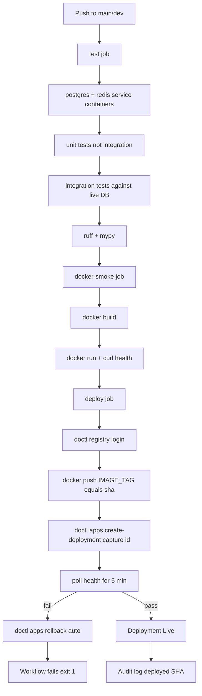

# Production Stability Implementation Plan

> **Status:** Active implementation plan derived from [`plans/infra-devops-review.md`](infra-devops-review.md) and the current code review of [`backend/packages/shared/db.py`](../backend/packages/shared/db.py), [`backend/packages/shared/config.py`](../backend/packages/shared/config.py), [`backend/Dockerfile`](../backend/Dockerfile), [`docker-compose.yml`](../docker-compose.yml), [`backend/app/core/lifespan.py`](../backend/app/core/lifespan.py), [`backend/app/core/rate_limit.py`](../backend/app/core/rate_limit.py), and [`.github/workflows/deploy.yml`](../.github/workflows/deploy.yml).
>
> **Supersedes:** the general architect instructions on planning; this is the *production-stability* workstream. All other architect work proceeds independently.

---

## Root Cause Summary

The findings trace back to **seven** systemic root causes. Every Phase below maps back to one or more of these.

| # | Root Cause | Symptoms it produces | Where it shows up |
|---|------------|---------------------|-------------------|
| RC-1 | **Logging discipline gap** — diagnostic prints were added to debug async-driver selection and never removed. | DB credentials at INFO log lines in [`backend/packages/shared/db.py:71, 74, 109-110, 114, 140-148`](../backend/packages/shared/db.py:71). | Phase 1 |
| RC-2 | **No fail-fast config validation** — [`Settings`](../backend/packages/shared/config.py:15) defaults `database_url`/`redis_url` to `localhost` with no production assertion. | App silently boots against `postgresql+asyncpg://localhost/whatismytip` in prod, traffic is misrouted. | Phase 2 |
| RC-3 | **Two migration owners** — both [`backend/Dockerfile:74-76`](../backend/Dockerfile:74) and [`docker-compose.yml:107-117`](../docker-compose.yml:107) can run alembic, on overlapping triggers. | Migration race conditions when the API container restarts mid-deploy while `init-data` is also upgrading. | Phase 2 |
| RC-4 | **CI does not exercise the production-shaped path** — integration tests are excluded (`-m "not integration"`), no DB service container, smoke step originally swallowed failures. | Broken deploys ship "green"; integration suite is dead weight in the deploy gate. | Phase 2 + Phase 4 |
| RC-5 | **Credentials in `.env` and `.do/app.yaml`** — `EV[...]` ciphertexts + plaintext dev defaults; legacy `scripts/deploy.sh` can recreate the FaaS app from the stale `.do/app.yaml`. | A secret leak today is a full-credential leak; an operator panic can recreate a deleted architecture. | Phase 1 + Phase 3 |
| RC-6 | **No rate-limit envelope on the edge** — only FastAPI `slowapi` exists; nginx has no `limit_req_zone`; in multi-worker FaaS the limiter used to be in-memory (now Redis-backed, but not fail-closed). | Edge DoS, multi-worker rate-limit drift, single-IP flood against admin endpoints. | Phase 3 |
| RC-7 | **Frontend CI absent + Nuxt 4.4.2 vulnerabilities** — `navigateTo`/`NuxtLink` XSS (GHSA-7g8q-q8jj-3wjh / GHSA-9pph-3h7c-6q3v); no `bun run test` step in `.github/workflows`. | Frontend regressions ship; XSS is exploitable today. | Phase 4 + Phase 5 |

---

## Phase 1 — Critical Security & Incident Response (Target: 24h)

**Objective:** stop the bleeding. Remove credential exposure, rotate compromised secrets, contain the impact.

### 1.1 Strip credential logging from `db.py`

**File:** [`backend/packages/shared/db.py`](../backend/packages/shared/db.py)
**Lines to change:** 71, 74, 109, 110, 114, 140, 141, 142, 147, 148, 161

| Line(s) | Current (paraphrased) | Replace with |
|---------|----------------------|--------------|
| 71 | `logger.info(f"DIAGNOSTIC _normalize_async_url: Input URL = {url}")` | **delete** |
| 74 | `logger.warning(f"DIAGNOSTIC ... URL does NOT have +asyncpg prefix!")` | Keep as `logger.debug(...)` |
| 109 | `logger.info(f"DIAGNOSTIC ... Returning clean_url = {clean_url}")` | **delete** |
| 110 | `logger.info(f"DIAGNOSTIC ... connect_args has SSL? ...")` | **delete** |
| 114 | `logger.info(f"DIAGNOSTIC ... No SSL needed, returning original URL ...")` | **delete** |
| 140 | `logger.info(f"DIAGNOSTIC: Original DATABASE_URL = {settings.database_url}")` | **delete** (this is the worst — full URL with creds) |
| 141–142 | `logger.info(f"DIAGNOSTIC: Has +asyncpg prefix? ...")` | **delete** |
| 147 | `logger.info(f"DIAGNOSTIC: Normalized db_url = {db_url}")` | **delete** (full URL) |
| 148 | `logger.info(f"DIAGNOSTIC: connect_args = {connect_args}")` | **delete** (SSL context may include servername) |
| 161 | `logger.info(f"DIAGNOSTIC: Engine created successfully with driver: ...")` | demote to `logger.debug(...)` and log only the driver name |

**Acceptance criteria**
- Grep over `backend/` returns no `f"...{settings.database_url}..."` or `f"...database_url..."` in any `logger.*` call.
- [`backend/tests/unit/test_no_credential_logging.py`](../backend/tests/unit/test_no_hardcoded_secrets.py) (new) passes: static scan over `packages/shared/` rejects any `logger.info`/`warning`/`error` whose message contains the literal string `database_url`, `redis_url`, `connect_args`, or `clean_url`.
- `docker compose up -d` shows clean logs on `docker compose logs api | grep -E "DATABASE_URL|database_url"` returning zero matches.

**Risk:** None — logs are diagnostic, behaviour unchanged.
**Rollback:** Re-apply the `logger.info(...)` lines.
**Test:** `uv run pytest backend/tests/unit/test_db_engine.py backend/tests/unit/test_no_hardcoded_secrets.py -v`; manual `docker compose logs api | head -50`.
**Dependencies:** None (independent).

### 1.2 Strip credential logging from any other site

Grep `backend/` for `logger.*f"` patterns containing `password`, `secret`, `token`, `key=` (excluding `api_key=` is fine because that's a Pydantic field name, not a value). Use [`backend/tests/unit/test_no_hardcoded_secrets.py`](../backend/tests/unit/test_no_hardcoded_secrets.py) as the regression net.

### 1.3 Rotate every secret referenced by `.env` and `.do/app.yaml`

**Action list (in order):**

1. **DO PostgreSQL** — `doctl databases user reset <db-id> wimt` → capture new password, store in GitHub Actions secret `DO_DATABASE_URL` (full URL).
2. **DO Managed Redis** — `doctl databases user reset <redis-id> default` → capture, store as `DO_REDIS_URL`.
3. **ADMIN_API_KEY** — generate `openssl rand -hex 32`, store as `DO_ADMIN_API_KEY`. Push to App Platform via `doctl apps update --env ADMIN_API_KEY=<value>`.
4. **OPENROUTER_API_KEY** — revoke on OpenRouter dashboard, generate new key, store as `DO_OPENROUTER_API_KEY`.
5. **DIGITALOCEAN_ACCESS_TOKEN** — rotate the PAT used by CI; update the GitHub Actions secret.
6. **DO_APP_ID** — unchanged (public), but verify still in `production` environment only.

**Acceptance criteria**
- All four production secrets differ from any value present in `git log --all -p -- .do/app.yaml .env` (audited).
- `doctl apps spec get <DO_APP_ID>` shows the new ciphertexts under the `fastapi` service component.
- `curl -fsS https://whatismytip.com/health` still 200.
- `curl -X POST -H "X-API-Key: <old-key>" https://whatismytip.com/api/admin/metrics` returns 401.

**Risk:** Service downtime window if rotation is mis-timed. Mitigate by performing steps 1–4 inside a maintenance window with `doctl apps update --env` applied before any deployment.
**Rollback:** DO retains previous values in `doctl databases user list` until the rotation completes; each secret can be reverted via `doctl apps update --env KEY=<old-value>`.
**Test:** Two smoke tests — one against the old key (must 401), one against the new (must succeed).
**Dependencies:** Phase 1.1 must land first; this work follows immediately.

### 1.4 Audit `.env` for committed leakage

1. Verify `.env` is **not** tracked: `git ls-files | grep -E '^\.env$|backend/\.env$' || echo "OK — .env is not tracked"`.
2. If it is tracked: `git rm --cached backend/.env && git commit -m "🔥 chore(security): untrack backend/.env"` then `git filter-repo --path backend/.env --invert-paths` to scrub history.
3. Add a CI guard: in [`.github/workflows/deploy.yml`](../.github/workflows/deploy.yml) `test` job, add a step `git ls-files | grep -E '(\.env$|secret|credential|keystore)' && (echo "❌ tracked secret-shape file"; exit 1) || true`.

**Acceptance criteria:** `git ls-files | grep -E "\.env$"` returns nothing.
**Risk:** Force-push required if history rewrite happens.
**Rollback:** Restore from backup branch.
**Dependencies:** None.

### 1.5 Quarantine `.do/app.yaml` and `scripts/deploy.sh`

Even after rotation, these files are still FaaS-era landmines that recreate the deleted architecture if anyone runs them. Per [`plans/infra-devops-review.md` CR-001 / CR-002 / CR-003](../plans/infra-devops-review.md).

**Tasks**
- Delete `.do/app.yaml`, `.do/frontend.yaml`, `.do/backend.Dockerfile`, `.do/frontend.Dockerfile` (the four FaaS-era specs).
- Delete `scripts/deploy.sh` (the legacy FaaS deployer).
- Replace `.do/README.md` with a single line: "DO App Platform spec is generated at deploy time; no tracked spec file exists."
- Update [`docs/deployment.md`](../docs/deployment.md) and [`docs/digital-ocean-setup.md`](../docs/digital-ocean-setup.md) to reference **only** `backend/scripts/deploy.sh` and the GitHub Actions workflow.

**Acceptance criteria:** `ls scripts/ .do/` returns no deploy/spec files (only the new README). `grep -r "doctl apps create" docs/ scripts/` returns nothing.
**Risk:** Operators relying on legacy docs need the new [`docs/deployment.md`](../docs/deployment.md) published before this lands.
**Rollback:** Restore files from the previous commit.
**Dependencies:** None.

### 1.6 Nuxt XSS mitigation (defence in depth — same 24h window)

Even though frontend dependency updates land in Phase 5, immediate mitigations:
- Pin the CSP in [`backend/app/core/middleware.py`](../backend/app/core/middleware.py) so that `script-src` does **not** include `unsafe-inline` (the default Nuxt dev build needs it; verify production build does not).
- Add `Content-Security-Policy-Report-Only` with `report-uri /api/csp-report` (new endpoint) so we capture any XSS attempt that the old vulnerable Nuxt allows.

**Acceptance criteria:** `curl -fsSI https://whatismytip.com/ | grep -i content-security-policy` shows a header without `unsafe-inline` in `script-src`.
**Risk:** Strict CSP can break third-party scripts. Phase 5 will align on a permanent policy.
**Rollback:** Remove the CSP header.
**Dependencies:** None.

---

## Phase 2 — Production Stability (Target: 24–48h)

**Objective:** make a broken deploy impossible to ship green, and make a misconfigured environment fail at boot.

### 2.1 Fail-fast env validation in `Settings`

**File:** [`backend/packages/shared/config.py`](../backend/packages/shared/config.py)

Add a `model_validator(mode="after")` on [`Settings`](../backend/packages/shared/config.py:15) that, when `settings.environment == "production"`, asserts:
- `database_url` is **not** `localhost` and uses `+asyncpg` or `+psycopg`.
- `redis_url` is **not** `localhost`.
- `admin_api_key` length ≥ 32 bytes (entropy floor).
- `cors_origins` does **not** contain `*` or `http://localhost` entries.
- `openrouter_api_key` is set (current default is `""`).

On violation: raise `ValidationError` from the Pydantic model — Pydantic-settings propagates the error so the import `from packages.shared.config import settings` fails, which means `uvicorn main:app` exits before binding the port.

In `development`/`test`, all assertions log a `WARNING` and continue (matching the existing `lifespan` policy).

**File:** [`backend/app/core/lifespan.py`](../backend/app/core/lifespan.py)

Extend [`_validate_production_security`](../backend/app/core/lifespan.py:30) to also fail-fast if `settings.environment == "production"` and `_db.get_engine()` fails **and** `/health` would be `degraded`. Today the lifespan degrades gracefully; in production a degraded engine must take the instance out of rotation by raising instead.

**Acceptance criteria**
- New unit test [`backend/tests/unit/test_settings_production_validation.py`](../backend/tests/unit/test_settings_cors_origins.py) (use existing test file structure) covers all five assertions.
- `ENVIRONMENT=production DATABASE_URL=postgresql+asyncpg://localhost/x uvicorn main:app` exits 1 within 1 second.
- `ENVIRONMENT=production DATABASE_URL=postgresql+asyncpg://prod-host/db uvicorn main:app` boots.

**Risk:** Existing deployments that relied on the localhost fallback will now fail. Mitigate by ensuring the App Platform spec is updated before this ships.
**Rollback:** Revert the `model_validator` and the lifespan change.
**Test:** New unit tests for validator; manual: `ENVIRONMENT=production DATABASE_URL=... uvicorn main:app`.
**Dependencies:** Phase 1.3 (rotation must be done first so the App Platform spec has the new values).

### 2.2 Single migration owner

**Conflict today:** [`backend/Dockerfile:74-76`](../backend/Dockerfile:74) runs `alembic upgrade head` on container start; [`docker-compose.yml:107-117`](../docker-compose.yml:107) runs `scripts/migrate_and_seed.py` (which itself runs alembic) in the `init-data` one-shot container. In production (App Platform) only the Dockerfile path fires — but if a future operator adopts compose-for-prod, both fire.

**Decision:** **Dockerfile owns migrations in production; compose `init-data` keeps the dev-only path.** Implement as follows.

- [`backend/Dockerfile:74-76`](../backend/Dockerfile:74) — keep the `alembic upgrade head` step **but add an idempotency guard** via the alembic version table. Today alembic already skips when `head` is current; we additionally wrap in a Python helper that exits 0 cleanly on transient lock errors (Postgres advisory lock).
- [`docker-compose.yml:107-117`](../docker-compose.yml:107) — keep as-is (this is the dev path; do not delete).
- New env var `RUN_MIGRATIONS_ON_START=true|false` (default `true` in prod, `false` in dev) gates the Dockerfile migration step. Dev sets it `false` and relies on `init-data`.

**File:** [`backend/scripts/run_migrations.py`](../backend/scripts/deploy.sh) (new) — extract the alembic call into a script with the lock-and-skip logic. Update Dockerfile `start.sh` to call this script.

**Acceptance criteria**
- Two simultaneous deploys of the same image to the same DB do not produce a `alembic.util.exc.CommandError: Can't locate revision identified by ...` or `Multiple head revisions` race.
- `RUN_MIGRATIONS_ON_START=false docker compose up -d api` still works (dev).
- `RUN_MIGRATIONS_ON_START=true docker compose up -d api` succeeds.
- New unit test `tests/unit/test_run_migrations.py` covers the idempotency branch (mock alembic to raise "already at head", assert exit 0).

**Risk:** Removing the dev compose migration could break local dev. Mitigate by keeping `init-data` for compose and setting `RUN_MIGRATIONS_ON_START=false` in compose's `api` service env.
**Rollback:** Set `RUN_MIGRATIONS_ON_START=true` and revert the new script.
**Dependencies:** Phase 2.1.

### 2.3 Make CI the deploy gate (kill the false-green)

**File:** [`.github/workflows/deploy.yml`](../.github/workflows/deploy.yml)

Three concrete changes:

1. **Smoke step fails the workflow** — already done (line 122 `exit 1`), but verify.
2. **Add `docker-smoke` post-build healthcheck** — after `docker build`, run `docker run --rm -d --name ci-smoke whatismytip-api:ci-smoke` and `curl -fsS http://localhost:8000/health` before the deploy job is allowed to start. This catches regressions in middleware/health code that unit tests miss.
3. **Capture deployment ID for rollback** — in the `deploy` job, capture `doctl apps create-deployment <app-id> -o json --format json` output, extract `id`, export as `DEPLOYMENT_ID` env, and print `doctl apps rollback <app-id> --deployment-id <previous-id>` instructions on failure.

**File:** [`backend/scripts/deploy.sh`](../backend/scripts/deploy.sh)

- Remove `--force-rebuild` (per [`plans/infra-devops-review.md` HI-009](../plans/infra-devops-review.md)).
- Increase health-poll window to 300 seconds (50 × 6s) per ME-009.
- Add `doctl registry login --registry "${DO_REGISTRY%%/*}"` pre-flight check (HI-004).
- After `/health` fails, attempt `doctl apps rollback <app-id>` automatically and log the rollback ID.

**Acceptance criteria**
- A deploy with a broken health endpoint fails the workflow AND auto-rolls back.
- `doctl apps list-deployments <DO_APP_ID>` shows the previous deployment as the "current" after a rollback.
- `docker run --rm whatismytip-api:ci-smoke && curl http://localhost:8000/health` succeeds in the `docker-smoke` job.

**Risk:** Auto-rollback on a transient `/health` miss could cycle the container. Mitigate by waiting 5 minutes before rolling back (the deploy.sh poll already runs for 5 minutes).
**Rollback:** Remove the `doctl apps rollback` step; revert `--force-rebuild`.
**Dependencies:** Phase 2.1.

### 2.4 Add a DB service to CI for migration verification

Today [`deploy.yml:42`](../.github/workflows/deploy.yml:42) runs `pytest tests/unit/ ... -m "not integration"`. Migrations never run against a real Postgres in CI.

**Add to `deploy.yml::test` job (before unit tests):**
```yaml
services:
  postgres:
    image: postgres:16-alpine
    env:
      POSTGRES_USER: wimt
      POSTGRES_PASSWORD: wimt_test
      POSTGRES_DB: whatismytip
    ports: ['5432:5432']
    options: >-
      --health-cmd "pg_isready -U wimt"
      --health-interval 5s --health-retries 10
  redis:
    image: redis:7-alpine
    ports: ['6379:6379']
    options: >-
      --health-cmd "redis-cli ping"
      --health-interval 5s --health-retries 10
```

Then run `uv run pytest tests/integration/ -m integration --tb=short` against the live services. The `-m "not integration"` filter stays for unit-only PRs; the integration run is gated to `push` to `main` and `dev`.

**Acceptance criteria**
- Integration suite runs green against a Postgres 16 + Redis 7 service container on every push to `dev`/`main`.
- The integration module that previously `NameError`'d on collection (per findings) is fixed (see Phase 4.1).

**Risk:** Flaky CI from external services. Mitigate by using `--health-retries 10` and 5-second timeouts, and by retrying the job once on flake.
**Rollback:** Remove the `services:` block and the integration test step.
**Dependencies:** Phase 4.1.

---

## Phase 3 — Infrastructure Hardening (Target: 1 week)

**Objective:** defence in depth at the edge, on the container, and in observability.

### 3.1 nginx edge rate-limit + security headers

**File:** [`backend/proxy/nginx.conf`](../backend/proxy/nginx.conf)

Add (per [`plans/infra-devops-review.md` CR-005 / HI-002 / HI-007 / ME-018 / ME-019](../plans/infra-devops-review.md)):
```nginx
limit_req_zone $binary_remote_addr zone=wimt:10m rate=30r/s;
limit_req_status 429;

server {
    # ...
    add_header X-Content-Type-Options "nosniff" always;
    add_header X-Frame-Options "SAMEORIGIN" always;
    add_header Referrer-Policy "strict-origin-when-cross-origin" always;
    add_header Strict-Transport-Security "max-age=31536000; includeSubDomains" always;

    location / {
        limit_req zone=wimt burst=60 nodelay;
        proxy_pass http://fastapi_upstream;
        proxy_buffer_size 16k;
        proxy_buffers 16 16k;
        gzip on;
        gzip_types application/json text/plain;
        gzip_min_length 256;
    }
}
```

Add `backend/tests/unit/test_proxy_config.py` cases asserting each header is present on `/health`, `/`, and an error page (403/404).

### 3.2 Container resource limits + non-root hardening

**File:** [`docker-compose.yml`](../docker-compose.yml)

For each of `api`, `init-data`, `frontend`:
- Add `cpus: "1.0"`, `mem_limit: 512m` (or per-service profile).
- Already has `security_opt: ["no-new-privileges:true"]` and `read_only: true` + tmpfs for `api` and `init-data`. Add the same to `frontend`.
- Drop `ALL` capabilities, add `NET_BIND_SERVICE` only if binding privileged ports (none do).

For production: add the equivalent to the App Platform service spec (via `doctl apps update --spec`).

### 3.3 Backend `.dockerignore`

**File:** [`backend/.dockerignore`](../backend/.dockerignore) (new — see HI-001)

```
.venv/
venv/
__pycache__/
*.pyc
.pytest_cache/
.mypy_cache/
.ruff_cache/
tests/
scripts/_*.py
*.log
.env
.env.*
!.env.example
data/
seed_data/
logs/
*.db
*.sqlite*
.git/
.gitignore
.gitattributes
docs/
README.md
LICENSE
Dockerfile
proxy/
list_routes.py
_fix_tests*.py
check.py
get_logs.py
```

Add unit test `tests/unit/test_dockerignore.py` asserting `.dockerignore` exists and contains `tests/` and `.env`.

### 3.4 Observability — structured logs + alerting

**File:** [`backend/packages/shared/structured_logging.py`](../backend/packages/shared/api_helpers.py) (new) — JSON log formatter with `request_id`, redact-on-serialize for `password`, `secret`, `token`, `api_key`. Wire into `app/core/lifespan.py` `logging.basicConfig(...)`.

Verify [`backend/tests/unit/test_structured_logging.py`](../backend/tests/unit/test_structured_logging.py) covers redaction.

Set `ALERT_WEBHOOK_URL` in the App Platform spec to a real Slack/PagerDuty hook. Add a runbook entry in [`docs/operations.md`](../docs/operations.md).

### 3.5 Backup policy

Document and test a backup/restore drill for the Postgres volume. Per the pre-flight checklist at [`plans/infra-devops-review.md:327-333`](../plans/infra-devops-review.md).

---

## Phase 4 — Testing & Quality (Target: 2 weeks)

**Objective:** every layer has behavioural tests that run in CI; orphan tests are deleted or fixed.

### 4.1 Fix orphan integration tests

The findings mention "orphaned integration test modules that NameError on collection". Discover them:
```bash
cd backend && uv run pytest tests/integration/ --collect-only 2>&1 | head -50
```
For each failure:
- If the test references a moved/renamed module, update the import.
- If the test references dead code (e.g. legacy `apps/<x>` modules), delete it.
- If the test is structurally fine but missing fixtures, add the fixture.

Add `tests/integration/conftest.py` with a `postgres` and `redis` fixture that connects to the service containers added in Phase 2.4.

### 4.2 Migrations tested against real Postgres

Add `tests/integration/test_alembic_migrations.py`:
- Spin up an empty Postgres, run `alembic upgrade head`, assert schema matches the model metadata (`sqlalchemy.MetaData.reflect`).
- Run `alembic downgrade base`, assert empty schema.
- Run `alembic upgrade head` again — must be idempotent and reach `head`.

This catches the `create_all`-vs-alembic drift before it hits production.

### 4.3 Behavioural frontend tests

Today [`frontend/tests/unit/*.test.ts`](../frontend/tests/unit/) are mostly static source-grep tests (`console-cleanup`, `lazy-images`, `slug-regex`). Replace the lowest-value three with behavioural tests:

| Test file | Replace with |
|-----------|--------------|
| `console-cleanup.test.ts` | Playwright spec asserting no `console.error` during `pages/index.vue` mount |
| `lazy-images.test.ts` | Playwright spec asserting `` appears on pages with team logos |
| `slug-regex.test.ts` | Vitest spec asserting `useGameSlug('Richmond v Carlton, R1 2025')` → `richmond-v-carlton-r1-2025` |

The `frontend/tests/game-detail-flow.spec.ts` Playwright spec already exists; promote it to CI.

### 4.4 Frontend CI workflow

**File:** `.github/workflows/frontend.yml` (new):
```yaml
name: Frontend CI
on:
  push:
    branches: [main, dev]
    paths: ['frontend/**']
  pull_request:
    paths: ['frontend/**']
jobs:
  test:
    runs-on: ubuntu-latest
    defaults: { run: { working-directory: frontend } }
    steps:
      - uses: actions/checkout@v4
      - uses: oven-sh/setup-bun@v1
        with: { bun-version: 1.3.6 }
      - run: bun install --frozen
      - run: bun run test
      - run: bun run build
```

Wire `frontend/package.json` `test` script to `vitest run` (currently it may be missing). Audit the existing [`frontend/vitest.config.ts`](../frontend/vitest.config.ts).

### 4.5 Static-secret scanner broadened

**File:** [`backend/tests/unit/test_no_hardcoded_secrets.py`](../backend/tests/unit/test_no_hardcoded_secrets.py) — per CR-006.

Replace `DO_PAT_PATTERN` with a list `SECRET_PATTERNS`:
- `dop_v1_[a-f0-9]{56}`
- `EV\[[0-9]+:[A-Za-z0-9+/=]+:[A-Za-z0-9+/=]+\]`
- `sk-or-[A-Za-z0-9_-]{20,}`
- `ghp_[A-Za-z0-9]{36}`
- `github_pat_[A-Za-z0-9_]{82}`
- `xox[baprs]-[A-Za-z0-9-]{10,}`
- `AKIA[0-9A-Z]{16}`
- `-----BEGIN [A-Z ]+PRIVATE KEY-----`

Run scanner in [`backend/tests/unit/`](../backend/tests/unit/) on every PR.

### 4.6 Coverage gates

Add `pytest --cov=app --cov=packages --cov-fail-under=70` to the unit step in `.github/workflows/deploy.yml`. Lower coverage is allowed for `app/cron/` and `scripts/` (integration-tested).

---

## Phase 5 — Long-term Improvements (Target: 1 month)

**Objective:** durability and forward-leaning security.

### 5.1 Dependency updates

- **Nuxt** — upgrade from 4.4.2 → latest 4.x; this resolves the `navigateTo`/`NuxtLink` XSS (track in `renovate.json` or dependabot).
- **Pydantic** — confirm `pydantic-settings >= 2.x`; verify no deprecation warnings on `model_config`.
- **Python** — keep at 3.12 (matches `backend/.python-version`).
- **Frontend `bun`** — pin `oven/bun:1.3.6` (currently `oven/bun:1` floats per HI-008).

### 5.2 Advanced security

- WAF rules at the edge (Cloudflare or DO App Platform's HTTP rules).
- Per-IP fail2ban-style auto-ban for 429 floods (FastAPI middleware or nginx `limit_req_dry_run` → fail2ban pipeline).
- Rotate `ADMIN_API_KEY` quarterly (calendar reminder in [`docs/operations.md`](../docs/operations.md)).
- Add a secrets-detection pre-commit hook (e.g. `gitleaks`).

### 5.3 Performance

- Move from `WORKERS=2` to `WORKERS=${WORKERS}` driven by App Platform instance size (per ME-005).
- Enable `proxy_buffering on` (removing the global `off`) for non-streaming endpoints.
- Add caching for `/api/games/{slug}` (currently re-queries on every request).
- Consider HTTP/2 + brotli at the edge.

### 5.4 Observability maturity

- Tracing: add OpenTelemetry to FastAPI (auto-instrumentation) + Postgres + Redis.
- Dashboards: Grafana panels for p95 latency, 429 rate, error rate per endpoint, DB pool wait time.
- SLOs: document `GET /api/games/{slug}` p95 ≤ 200ms (today no SLO exists).

### 5.5 Multi-region (optional)

The app is currently single-region (`syd`). If traffic warrants: add a `sfo3` failover with read-only Postgres replica + Redis primary. Out of scope for this plan.

---

## Cross-Phase Risk Register

| Risk | Phase | Mitigation | Trigger to escalate |
|------|-------|------------|---------------------|
| Rotation breaks a live deploy | 1.3 | Rotate inside a maintenance window; keep DO console open; have `doctl databases user reset` reversal ready | `/health` 5xx after rotation |
| Fail-fast validator rejects a valid prod config | 2.1 | Validator only triggers when `environment=="production"`; test matrix covers dev/staging/prod permutations | New exception type in sentry |
| Migration race during rolling deploy | 2.2 | Idempotency guard via `alembic_version` table; rollback to single-image restart | Two deploys overlap with same `IMAGE_TAG` |
| Integration tests flake on CI | 2.4 / 4.2 | Use the official `postgres:16-alpine` and `redis:7-alpine` service containers; retry-once policy | > 5% flake rate over 50 runs |
| CSP breaks a third-party script | 1.6 | Use `Content-Security-Policy-Report-Only` first; promote to enforcement in Phase 5 after one week of clean reports | Report URI shows > 0 violations/day |

---

## Acceptance Checklist (end of Phase 5)

Use this as the "we are production-stable" gate. Every box must be green before declaring victory.

- [ ] `git ls-files | grep -E "\.env$|EV\[|sk-or-|ghp_|dop_v1_"` returns nothing.
- [ ] All four production secrets (DB password, Redis password, admin key, OpenRouter key) rotated and stored only in GitHub Actions `production` environment secrets.
- [ ] `ENVIRONMENT=production DATABASE_URL=postgresql+asyncpg://localhost/x uvicorn main:app` exits 1 in <1s.
- [ ] `doctl apps list-deployments <DO_APP_ID>` shows every successful deploy followed by a passing `/health` smoke within 5 minutes.
- [ ] `curl -fsSI https://whatismytip.com/` returns `X-Content-Type-Options`, `X-Frame-Options`, `Referrer-Policy`, `Strict-Transport-Security`.
- [ ] `bun run test` is green in CI on every PR to `dev`/`main` that touches `frontend/**`.
- [ ] `uv run pytest tests/integration/ -m integration` is green in CI on every push to `dev`/`main`.
- [ ] No Nuxt version in `frontend/package.json` is < 4.4.3 (or whatever the XSS-patched release is at execution time).
- [ ] nginx `/healthz` block returns 200 under a 30 r/s flood from a single IP (rate-limit smoke test).
- [ ] `docker exec <wimt-api> ps aux` shows the uvicorn worker PID running as `appuser` (UID not 0).
- [ ] `docker exec <wimt-api> ls /app/tests/` returns "No such file or directory" (Phase 3.3 regression guard).
- [ ] `bash -n backend/scripts/deploy.sh && shellcheck backend/scripts/deploy.sh` is clean.
- [ ] `docker compose up -d` boots the full stack with `RUN_MIGRATIONS_ON_START=false` for `api` (dev) and the stack survives `docker compose down && docker compose up -d` (migration idempotency).

---

## Appendix A — Mermaid: deploy gate flow (target state)



## Appendix B — Mermaid: secret rotation lifecycle


## Appendix C — Effort & Complexity

| Task | Effort band | Complexity | Owner role |
|------|-------------|-----------|-----------|
| 1.1 strip credential logging | Small | Trivial | Backend dev |
| 1.3 secret rotation | Small | Medium (operator coordination) | SRE / dev |
| 1.5 quarantine legacy deploy files | Small | Low | Backend dev |
| 2.1 fail-fast validator | Small | Medium (Pydantic nuance) | Backend dev |
| 2.2 single migration owner | Medium | Medium (concurrency testing) | Backend dev |
| 2.3 deploy gate failures | Medium | Medium (rollback safety) | SRE / dev |
| 2.4 CI DB service | Small | Low | DevOps |
| 3.1 nginx hardening | Small | Low | SRE |
| 3.2 container limits | Small | Low | DevOps |
| 3.3 dockerignore + test | Small | Low | Backend dev |
| 3.4 structured logging | Medium | Medium (redaction + middleware) | Backend dev |
| 4.1 fix orphan tests | Medium | Variable (depends on count) | Backend dev |
| 4.2 migration integration tests | Medium | Medium (DB lifecycle) | Backend dev |
| 4.3 behavioural frontend tests | Medium | Medium (Playwright maturity) | Frontend dev |
| 4.4 frontend CI workflow | Small | Low | DevOps |
| 4.5 broadened secret scanner | Small | Low | Backend dev |
| 4.6 coverage gates | Small | Low | DevOps |
| 5.1 dependency updates | Large | Medium (Nuxt major-version risk) | Frontend dev |
| 5.2 advanced security | Large | High | SRE |
| 5.3 performance | Large | Medium | SRE / backend |
| 5.4 observability | Large | Medium | SRE |

---

## Appendix D — Out of Scope

These items are intentionally **not** covered here (tracked separately):

- Migrating from App Platform to Kubernetes (see [`plans/faas-architecture-review.md`](../plans/faas-architecture-review.md)).
- Replacing nginx with a managed edge (Cloudflare / Fastly).
- Multi-region failover.
- Moving from Postgres to a serverless alternative (Neon, Supabase).
- AI-feature expansion (the existing tip-generation flow is stable).

---

**End of plan.** Begin execution with Phase 1, task 1.1. Use the cross-phase risk register as the on-call reference if any task fails its acceptance criteria.
